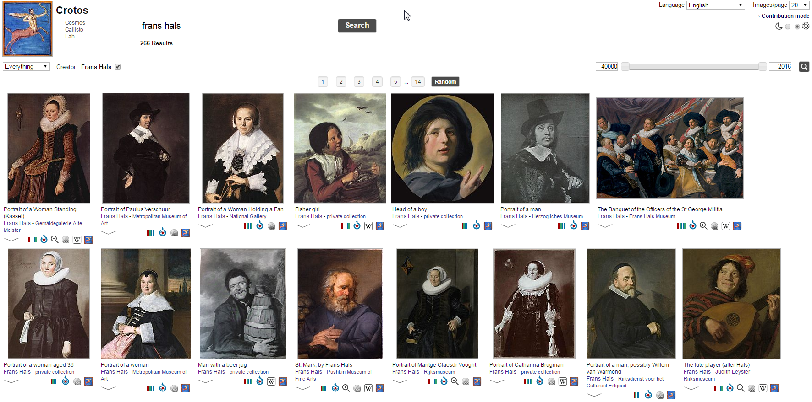

# Knowledge Graphs

## What are KG?

Not an entirely new idea

- [A Brief History of Knowledge Graph's Main Ideas](http://knowledgegraph.today/paper.html): A tutorial (from 1960 to the present)
  - History of ideas that have led to KGs, which stem from scientific advancements in diverse research areas such as Semantic Web, Databases, Knowledge Representation and Reasoning, NLP, Machine Learning
- Semantic Web proposed by TimBL together with the normal web (1989), active dev since 2000
- [Knowledge Graph](https://en.wikipedia.org/wiki/Knowledge_Graph): term introduced by Google (2012)

Nowadays:

- Inroads of Knowledge Graphs in large enterprises
- Convergence of statistical and logical methods (ML+KR/KG), 
- Graph databases, RDF vs property-graph languages and their potential convergence ([W3C Workshop on Web Standardization for Graph Data](https://www.w3.org/Data/events/data-ws-2019/report.html))
- KGs have taken the enterprise world by storm
  - Google, Amazon, Microsoft (Office, Bing, Microsoft Academic), Samsung, Springer Nature, AirBnB, Refinitiv/Thomson Reuters, Pitney Bowes, Capital One, Goldman Sachs, Wells Fargo, AstraZeneca, Bayer, Accenture, United Nations, US National Library of Medicine, DE National Library of Science and Technology…

## KG: What Is New?

- Why the recent popularity?
  - Web-scale approaches to data (tens of billions of facts)
  - Much easier data integration (within and between enterprises)
  - Synergies with ML/DL
- Distinguishing characteristics of KGs
  - Represent a holistic view of data in some domain across applications and possibly beyond application life cycles.
  - Whole enterprise or across enterprises.
  - Web-scale data (many billions of triples).
  - Have semantic grounding: semantic data modeling (ontologies and RDF shapes), integration, reasoning
  - Dynamic both regarding the data (live), and the data model (evolution).
- Specialized techniques 
  - To enable easier data integration, harmonization and data model evolution
  - Eg: graph databases, ontology-based data access, schema-less data integration
  - Unlike traditional Relational Databases (fixed schema) or Knowledge Bases (limited scale)

## How are KG Different from Data Warehousing?

- Semantic databases (Knowledge Bases or Knowledge Graphs) are self-describing
- Data warehousing usually focuses on statistical data (OLAP)
- KGs can represent OLAP using the W3C Cube ontology, but can also represent any other kind of data
- There are vast LOD datasets that can be utilized in building KGs
- Everyone seems to be building a KG!

## Google KG: Entity Pages, Disambiguation


## KG Resources
- [Knowledge Graphs: New Directions for Knowledge Representation on the Semantic Web](http://drops.dagstuhl.de/opus/volltexte/2019/10328/): high-level Dagstuhl seminar (Mar 2019) that outlines what are the important current problems
- [A Practical Guide to Build an Enterprise Knowledge Graph for Investment Analysis](https://towardsdatascience.com/a-practical-guide-to-build-an-enterprise-knowledge-graph-for-investment-analysis-3a15363098b7) 
  "How to solve the practical problems when building a real Enterprise Knowledge Graph service"
  Describes a Chinese effort to build a KG about companies, what data and processes they used...
  - Similar effort: Ontotext's [Intelligent Matching and Linking of Company Data](https://www.ontotext.com/cima/) project (CIMA) project 
- Using Linked Data Effectively. [EUCLID project](http://euclid-project.eu/), Dec 2013, 207 pages. 
  Available as HTML, iBook, ePUB, Kindle and course modules.
  This is an older resource but describes systematically topics in semantic data integration.
- Ontotext [Semantic Technologies Course](https://ecatalog.nbu.bg/default.asp?V_Year=2019&YSem=1&Spec_ID=&Mod_ID=&PageShow=coursepresent&P_Menu=courses&Fac_ID=4&M_PHD=0&P_ID=3049&TabIndex=2&K_ID=52256&K_TypeID=10) at NBU MS Data Science

## Competence Questions

- Before developing applications, one better develop business requirements
- Before procuring/integrating data, one better develop competence questions
- These are sample questions that the KG should be able to answer
- They should lead both dataset research and semantic modeling

## Semantic Data Integration

How to build a KG (steps):

- Dataset research (2)
- Data analysis
- Data cleaning
- Semantic model: examples, shapes, documentation
- Ontology engineering
- Data mapping/conversion (ETL)
- Coreferencing/matching/reconciliation (1)
- Data fusion/harmonization
- Semantic text/metadata enrichment
- Data enrichment, inference, aggregation
- Sample queries
- Semantic search, apps, visualizations

We'll only describe (1) and (2) below

## Coreferencing

One of the important steps of KG building

* Synonyms: Instance matching, entity linking, coreferencing, deduplication, record linking
* Overlapping instances across multiple datasets (proprietary and/or LOD) are matched and the sum of their attributes across datasets become available for querying
* This problem is critical in semantic data integration
* Finds data instances that refer to the same real-world entity
* Modification: the process of transforming a "string" (name) to a "thing" (URL) based on the provided semantic context

## Coreferencing Varieties

Basic Reconciliation:

* Fuzzy name matching
* Simple additional features (e.g. exact string matches, popularity ranking, differences in coordinates/numbers)
* Out-of-the-box match scoring

Advanced Reconciliation:

* Custom field parsing - additional parsing rules (acronyms, titles, dates etc)
* Complex additional features (text analysis, hierarchical features, geographical features, network topology, etc.)
* Custom match scoring
* Alignment Learning (possibly deep learning)

# Linked Open Data

## Dataset Research

- Given a data goal (competence questions), what datasets are available and relevant?
- What is the enterprise data that we "intuitively" know should be captured?
- Are there data gaps compared to the competence questions? How can we fill them?
- What LOD datasets can be leveraged?

## How to Find Datasets?

- Keep abreast of LOD developments in your domain (Knowledge and experience helps)
- Read [Semantic Web Journal "dataset descriptions" series](http://www.semantic-web-journal.net/accepted-datasets) 
- Wikidata's [`external-id` props](https://www.wikidata.org/wiki/Special:ListProperties/external-id) are an excellent source (over 3700)
- A lot of them have corresponding [Mix-n-Match](https://tools.wmflabs.org/mix-n-match/#/) catalog
  - A lot are potentially applicable to GLAM, eg Authority control for people 510, Identifier 196, Authority control 102, Authority control for artists 59, Cultural heritage identification 34, etc
- Wikipedia categories and Related links
- [DataHub](https://datahub.io) and [Old DataHub](https://old.datahub.io)
- [LOD Cloud](http://lod-cloud.net)

By Example:

- Eg to find computer science awards, get a famous computer scientist (eg Tim Berners-Lee) and explore his awards
- Eg to find artist biographic info, get a well-known artist (eg Emily Carr), find mentions of her on the web, list the ones that provide good biographic text

## LOD Cloud

1234 datasets, 16136 links between datasets, 30B triples


## LOD Cloud Growth


# Wikidata

## Wikidata and GLAM

- Wikidata is one of the most important LOD datasets for GLAM
- It is also a platform for integrating and leveraging GLAM data
- [Wikidata Strategy 2019](https://meta.wikimedia.org/wiki/Wikidata/Strategy/2019) includes 3 parts, of which "Wikidata as a platform" is strongly GLAM-oriented
- Very strong [GLAM Wiki](https://outreach.wikimedia.org/wiki/GLAM) outreach including:
  - Case studies on [sharing Digital Collections](https://outreach.wikimedia.org/wiki/GLAM/Digital_collections) including Documenting 3D objects, Documenting living traditions, Digitization workflows, Enriching digitized content, Sharing and integrating digitized content
  - Advice on [Sharing Knowledge](https://outreach.wikimedia.org/wiki/GLAM/Sharing_Knowledge): Editathons, Workshops, Backstage Events, GLAM professionals contributing, Embedded Wikimedians, Online editing campaigns, Wikidata and institutional metadata, Embedding Wikimedia Content, GLAM + Education
- Numerous GLAM projects realized, including [Bulgarian State Archives case study](https://outreach.wikimedia.org/wiki/GLAM/Case_studies/Bulgarian_Archives_State_Agency)
- Wikipedian in Residence with institutions like British Library, Wales National Library, Europeana, etc etc

## Describing a Painting

- Example: [Batsheba (in Reasonator)](https://tools.wmflabs.org/reasonator/?lang=en&q=19863043)


## Wikidata Project Visual Arts

[Wikidata:WikiProject_Visual_arts](https://www.wikidata.org/wiki/Wikidata:WikiProject_Visual_arts) (former name Sum of All Paintings) defines [Item structure](https://www.wikidata.org/wiki/Wikidata:WikiProject_Visual_arts/Item_structure) (very rich metadata) for various CH objects

- eg "depicts Iconclass notation: 71H712"
  
Leads to a detailed description and classification using an Iconographic notation (in this case a typical Biblical situation)

- 71H71 David, from the roof (or balcony) of his palace, sees Bathsheba bathing
  - 71H712 Bathsheba attended by servant(s)
    - Bathsheba · David · Old Testament · Samuel-2 11-12 · balcony · bathing · bible · love at first sight · maidservant · palace · roof · spying

# Wikidata: Tools of the Trade

## Quick Statements for Data Loading/Editing

[QuickStatements](https://tools.wmflabs.org/quickstatements), [QS Help](https://www.wikidata.org/wiki/Help:QuickStatements)


## QuickStatements Batches


## Google Sheets for Cleaning/Matching

Vladimir Alexiev, [How to use Google Sheets to Manage Wikidata Coreferencing](https://gist.github.com/VladimirAlexiev/8201d614a819cb7d4023ce9aa315af65), Mar 2017.


# OpenRefine

## OpenRefine for Data Cleaning

- Created by MetaWeb for mass-edits of FreeBase
- Bought by Google when FreeBase became part of the Google KG (Google Refine)
- Open sourced by Google (Google Refine) around the time when they donated FreeBase to be incorporated in WikiData
- A very powerful tool for cleaning and transforming tabular data

## OpenRefine Resources

- Linked Data for Digital Libraries (TPDL 2013 Tutorial)- Data Cleaning, Structuring with OpenRefine
- Getty Vocabularies Reconciliation Service Using OpenRefine (201905)
- A survey of OpenRefine reconciliation services
- Getty Vocabularies Reconciliation Example Using OpenRefine (2018)
- OpenRefine Tutorial - Enipedia (2017).htm
- Automating the Reconciliation of Named Entities to LCNAF (using OpenRefine and VIAF, 201709)
- Using OpenRefine's Reconciliation to Validate Local Authority Headings (CCQ 2017)
- Evaluating the success of vocabulary reconciliation for cultural heritage collections (JASIST 2012)
- How to pick the low hanging fruits of Linked Data (DCMI 201405) slides
- Converting Spreadsheets into MODSXML using Open Refine
- Google Refine tutorial (David Huynh 2011)
- OpenRefine Tutorial (v1.5 2013)
- Ruben Verborgh, Max De Wilde. Using OpenRefine (Packt Publishing, 2013)

## OpenRefine Software Ecosystem


## OpenRefine: Extracting from Wikipedia

Tutorial [Extracting From Wikipedia Tables](https://www.wikidata.org/wiki/Wikidata:Tools/OpenRefine/Editing/Tutorials/Inverse_Listeria) (Inverse Listeria). 
Eg [List_of_metro_systems](https://en.wikipedia.org/wiki/List_of_metro_systems) (notice the references)!


## OpenRefine: Extracted Info


## OpenRefine: Mapping to Wikidata


## OpenRefine Reconciliation

Map strings to things (eg persons to Wikidata and VIAF)


## OpenRefine Recon against Wikidata


# Authority Control

## Authority Control Hub

- One of the most important uses of WD is as Authority Control hub (coreferencing).
- Out of 6k WD props, about 3.5k link to external databases (authorities, museum collections, protected monuments, research articles, etc)
- Wikipedia has strong Authority Control practices that are fed with WD data


## Leveraging Coreferences

- Once you have a hub, you can easily proliferate identifiers across systems
- Eg here, RKDartists (not yet VIAF contributor) can be added to VIAF easily


## Mix-and-Match for Coreferencing

About 3000 catalogs (external databases) loaded to MnM:


## MnM: One Catalog


## MnM: Human Matching/Vetting Tools


## Beacon and SPARQL for Matching/Counting

[How to Count ULAN and SNAC in Wikidata](https://docs.google.com/document/d/1F4FGJqJ2lWponSnzxQpJR6Nq87Ecv3qXJ4ExcmWgIvU/edit)

- SNAC: Social Networks and Archival Context. WD [P3430](https://www.wikidata.org/wiki/Property_talk:P3430) says "130,137 uses"
- ULAN: Getty Union List of Artist Names. WD [P245](https://www.wikidata.org/wiki/Property_talk:P245) says "83,482 out of 293,158 (28% complete)"
- [BEACON](https://tools.wmflabs.org/wikidata-todo/beacon.php): simple tool to dump out coreferences.
  - Shows the cross-matches SNAC - WD - ULAN


# Wikidata Consumption

## Reasonator: View an Item


## Reasonator: Lots of Details!


## Reasonator: Lots of Details!


## SQID: Browse Props and Subclasses

Number of Creative Works and Cultural Institutions in Wikidata:


## Wikidata Query

Eg [Paintings by Titian](https://w.wiki/GNu)

```sparql
#defaultView:ImageGrid
select ?painting ?paintingLabel ?locationLabel ?image ?coords {
  ?painting 
    wdt:P31/wdt:P279* wd:Q3305213; # is a (subclass of...) painting
    wdt:P170 wd:Q47551; # Titian
    # wdt:P131/wdt:P361* ?location; # location (is part of...)
    wdt:P18 ?image.
  ?location wdt:P625 ?coords. # location has coordinates
  SERVICE wikibase:label { bd:serviceParam wikibase:language "[AUTO_LANGUAGE],en". }
} 
```

## How to Write Queries?

WD queries look like gibberish because of the numbers but:

- Has auto-completion when writing
- Has popups while examining
- End-users can change params without changing the query structure (Query Helper)
- You can ask for help at or twitter `@WikidataFacts`


## Titian Paintings

WD knows about 317 across many institutions: excellent for making a Catalog Raisonne. Can also show timeline (Histropedia is better!), geo map...


## Histropedia

Create great timelines


## Geo Mapping

Easily create geo maps, with readouts, als can make layers


## openArtBrowser

- Deployed at [http://openartbrowser.org/](http://openartbrowser.org/)
- Bernhard Humm. [Fascinating with Open Data: openArtBrowser](http://ceur-ws.org/Vol-2535/paper_2.pdf). Conference on Digital Curation Technologies ([Qurator 2020](https://dblp.org/db/conf/qurator/qurator2020.html)), Berlin, Germany, January 20th - 21st, 2020. [CEUR Workshop Proceedings 2535](http://ceur-ws.org/Vol-2535/).
- A very estethically pleasing app. Shows what is possible when you have rich metadata linked to LOD.
- [Staedel Museum custom deployment](https://sammlung.staedelmuseum.de/en): great site built with that software. 
  - See the albums (virtual exhibitions)
  - Eg see [das-denkmal-1975-1986](https://sammlung.staedelmuseum.de/en/work/das-denkmal-1975-1986)
  - Note that you can explore related artworks by any of the tags in its description. 
- Built over Wikidata using Elasticsearch.
- Would be marvelous to deploy this for Bulgarian icons.

## openArtBrowser: floating in air

Iconclass topical classification "[floating in air](https://sammlung.staedelmuseum.de/en/search?scope=all&q=term(12196:iconclass))": 107 objects, from classical paintings to photo of a Communist memorial being removed.


## Crotos

[Crotos](http://zone47.com/crotos/?l=en): browse paintings



## Monumental

Monuments, make maps


# Bulgarian Icons

## Virtual Encyclopedia of Bulgarian Icons (BAS IMI BIDL)

[BAS IMI BIDL](http://bidl.cc.bas.bg/)


## BIDL Data

- Got 500 objects, custom XML
- However, don't have copyright clearance for the images
- This is unfortunate because Wikidata images use Wikimedia Commons, for centralized management
- Such images are very important in most kinds of applications
- There are many images of Balkan icons already in Commons
- The project [Structured Data on Commons](https://meta.wikimedia.org/wiki/Structured_Data_on_Commons) makes it easy for GLAM to describe CH images, using a Wikidata approach and linking to Wikidata for creator, location, depicted elements, etc
- Commons also supports DeepZoom (incl. GigaPixel), eg see [Montserrat_Casas_de_Nieto,_in_Evening_Dress](https://tools.wmflabs.org/zoomviewer/index.php?f=Ram%C3%B3n_Casas_-_Montserrat_Casas_de_Nieto,_in_Evening_Dress_-_Google_Art_Project.jpg)

## BIDL Schema

Deduced schema, about 60 elements:

```xml
#<?xml version="1.0" encoding="utf-8"?>
#<xml>
  <object id="\d+">
    <characteristics>
      Идентификация
        Заглавие:bg:en
        Тип на иконографския обект
          (Икона|Мозайка)
          друг:bg:en
          Пластичен обект
            друг:bg:en
        Автор:bg:en
          Биография на автора:bg:en
          Иконографски род:bg:en
        Иконописна школа:bg:en
        Период
          От
            (Година|Век)
              (начало|среда|край|първа половина|втора половина)
          До
            (Година|Век)
              (Месец|Ден)
              (начало|среда|край|първа половина|втора половина)
        Размери \(см\)
          височина
          ширина
          дебелина
        Местонахождение
          Държава:bg:en
          Област:bg:en
          (Град|Село):bg:en
          (Галерия|Музей|Частна колекция):bg:en
          Частна колекция
          Друго местонахождение:bg:en
        Място на създаване
          Държава:bg:en
          Област:bg:en
          (Град|Село):bg:en
          (Манастир|Църква|Параклис):bg:en
          Църква
          Друго място на създаване:bg:en
        Бележки към идентификацията на обекта:bg:en
      Описание
        Персонажи
(          Име на персонаж:bg:en
(          Каноничен тип на персонаж:bg:en\n)?)*
        Иконографски сцени
          Иконографска сцена:bg:en
          Присъстващ персонаж в сцена(:bg:en)+
        Описание на обекта:bg(:en)?
      Технология
        Иконографска техника:bg:en
          Описание на техниката:bg:en
        Основа:bg:en
          Описание на основата:bg(:en)?
        Състояние, реставрационни намеси и коментари((:bg)?:en)?
      Файлове
    <files>
      <file
```

## BIDL Data Mapping Opportunities

- Working on mapping to EDM (simpler) and Wikidata (harder, more profitable)
- Lots of nested well-structured info, eg "Местонахождение> Държава> Област> Село> Манастир"
  - Has to be flattened out for Europeana, eg concatenated to a single field `dct:spatial`
- Great opportunity for semantic enrichment, see *highlights* below. 
  - Donated about 1395 to the *Poganovo monastery* by *Empress Elena Paleologus*, daughter of the monastery's sposor *Despot Deyan* and granddaughter of *Tsar Ivan Alexander*.
  - *Dimiter T. Molerov*, born in 1780 in *Bansko*, son of *Toma Vishanov the Moler*. One of the best-known painters, a representative of the *Bansko* school of art, a disciple of his father, influenced by the art of *Athos*. Author of the murals of the naos in the *St Archangels' paraclete* (параклис) in the *Rila monastery*, the murals in the *Church of the Assumption of the Virgin* in the *Pchelino dependance* (метох)
- But I doubt how many of these entities are in Wikidata/DBpedia :-(

## BIDL Authority Mapping


## Adding Icon Concepts

- Icons involve many specific concepts for techniques, materials, subjects, and iconography (religuous subjects)
- These are described in "ерминии" (herminia, WD [Q3408234](https://www.wikidata.org/wiki/Q3408234)) which are "How to Guides" for icon painters
- We should deepen Getty AAT and WD with Bulgarian/Balkan-specific icon and ethnographic concepts

Example:

- Getty has only [AAT 300239260](http://www.getty.edu/vow/AATHierarchy?find=belt+buckle&logic=AND&note=&subjectid=300239260) "belt buckle" 
- Wikidata has more detail and is easier to add to than Getty.
- Wikidata has [WD Q25457974](https://www.wikidata.org/wiki/Q25457974) "Пафти": I added "subclass of: belt buckle", image
- Commons: [Belogradchik-hitorical-museum-19century-belt-buckle-14.jpg](https://commons.wikimedia.org/wiki/File:Belogradchik-hitorical-museum-19century-belt-buckle-14.jpg):
 - Added Structured metadata: depicts: pafta; location: Belogradchik History Museum

## Dicho Zograf

- One of the prolific iconographers was Dicho Zograf. He's worked in tens of places, his icons are in hundreds of churches, and he made 2-10 thousands of icons.
- He also left 2 handwritten herminias
- His family tree is shown
- His work and legacy spanned 3 Balkan countries (BG, MK and SR claim him for their own):
  - He is Bulgarian: [Дичо Зограф](https://bg.wikipedia.org/wiki/%D0%94%D0%B8%D1%87%D0%BE_%D0%97%D0%BE%D0%B3%D1%80%D0%B0%D1%84) on bgwiki. Български иконописец, виден представител на Дебърската художествена школа.
  - He is Macedonian: [Дичо Зограф](https://mk.wikipedia.org/wiki/%D0%94%D0%B8%D1%87%D0%BE_%D0%97%D0%BE%D0%B3%D1%80%D0%B0%D1%84) on mkwiki. Годишно работел по околу педесет големи дела. Во нашите краишта го донел барокот кој доаѓал преку Света Гора и Солун,преку македонските мијачки зографи и резбари кои го учеле занаетот во манастирот “Зограф” на Атос.
  - He is Serbian: [Димитар Крстевић](https://sr.wikipedia.org/wiki/%D0%94%D0%B8%D0%BC%D0%B8%D1%82%D0%B0%D1%80_%D0%9A%D1%80%D1%81%D1%82%D0%B5%D0%B2%D0%B8%D1%9B) on srwiki. Био је иконописац и представник дебарске уметничке школе.

## Dicho Zograf's Icons

- The bgwiki article shows maybe 30 of his icons.
- Wikimedia commons has 56 of [Dicho Zograf's Icons](https://commons.wikimedia.org/wiki/Category:Dicho_Zograf) icons/paintings, CC Zero license
- This is less than 2% of his total works.
- But it's still significant: if we guesstimate 100 iconographers on WD and assume the average is *twice less*, that makes 2800 icons with cleared rights across Commons.


## Commons Metadata and Wikidata Item

- The [info about an icon on Commons](https://commons.wikimedia.org/wiki/File:Church_of_the_Presentation_of_Virgin_Mary_Ku%C4%8Devi%C5%A1te_Dicho_Zograf_Jerusalim.jpg) is poor: author, date; title and place are embedded in the filename and cannot be extracted easily.
- The Structured Info (see second tab), eg Depicted, is empty.
- I would guess that none if these icons have a WD record.
- Dicho Zograf's WD item [Q12278833](https://www.wikidata.org/wiki/Q12278833) and [Commons Creator](https://commons.wikimedia.org/wiki/Creator:Dicho_Zograf) page  are also poor:
- Birth/death date/place and a bunch of identifiers, and links to Wikipedia pages, that's all

## Editing Wikidata

Let's enrich WD [Q12278833](https://www.wikidata.org/wiki/Q12278833) Dicho Zograf from bgwiki [Дичо Зограф](https://bg.wikipedia.org/wiki/%D0%94%D0%B8%D1%87%D0%BE_%D0%97%D0%BE%D0%B3%D1%80%D0%B0%D1%84):

- Дебърска художествена школа! (listed as "Macedonian carving" subclass of carving; I added class "painting movement")
- баща: зограф Кръсте Дичов Перков!
- учи се при: зографа Кръсте Дичов Перков!, а после при зографите Михаил Анагност! от Самарина! и сина му Димитър! (Михайлов).
- ерминията на Дичо Зограф: [Q84082005 Herminia of Dicho Zograf](https://www.wikidata.org/wiki/Q84082005)
  - collection [Q84082027 Slavic-Byzantium Research Center "Prof. Ivan Duichev"](https://www.wikidata.org/wiki/Q84082027), inventory number "Cod. D. Slavo 412"

## Editing Data About an Icon
- Първото дело на Дичо Зограф - [Q84296272](https://www.wikidata.org/wiki/Q84296272) Света Богородица Пантонхара, 1844
- от „Свети Йоан Богослов Канео“! (commissioned by)
- днес в Охридската галерия за икони! (collection)
- physical description: темпера, гипсен грунд на дъска, 57 х 41 х 4 cm
- described in article [Q84291564](https://www.wikidata.org/wiki/Q84291564) The icon of the Mother of God Pantonhara in the Icon Gallery, an article by Milco Georgievski 
  - published on 26 October 2014 in [Q84298592](https://www.wikidata.org/wiki/Q84298592) Ikonimaalari 2/2014 (ISBN 978-952-301-024-6)
    - Which is an issue of the Finnish journal on icons [Q84298370](https://www.wikidata.org/wiki/Q84298370) Ikonimaalari (ISSN 1455-7975)
  - English edition at academia.edu paper [9843052](https://www.academia.edu/9843052) The icon of the Mother of God Pantonhara in the Icon Gallery
  - proposed Wikidata prop [academia.edu_work_id](https://www.wikidata.org/wiki/Wikidata:Property_proposal/academia.edu_work_id) so we can link to academia.edu (in this case, it's the only source for that rare article)

# Icons: Current Status

## Icon Class ([SQID Q132137](https://tools.wmflabs.org/sqid/#/view?id=Q132137))


## Icons by Author
- Only 623 icons on wikidata as of 3-Feb-2020: [tweet](https://twitter.com/valexiev1/status/1224274473186201608)
- 268 (43%) with image, 355 (47%) without: [query](https://w.wiki/GYn)
- 33% have no author, 46% is "anonymous", 20% are "noname" Masters, [Nikolaos_Tsafouris and Nikolaos_Zafouris should be merged](https://commons.wikimedia.org/wiki/Commons:Administrators%27_noticeboard/User_problems#merge_Nikolaos_Tsafouris_and_Nikolaos_Zafouris) on Commons: [query](https://w.wiki/GYi)


## Icons with Images ([query](https://w.wiki/GYo))


## Iconographer: Dicho Zograf ([Q12278833](https://tools.wmflabs.org/reasonator/?&q=12278833))


## Multilingual: BG vs EN ([Q12278833](https://tools.wmflabs.org/reasonator/?q=Q12278833&lang=bg))


## Work: Herminia ([12278833](https://tools.wmflabs.org/reasonator/?&q=12278833))


## Institution: Ivan Duichev Center ([84082027](https://tools.wmflabs.org/reasonator/?&q=84082027))


## Icon: Mother of God Pantonhara ([Q84296272](https://tools.wmflabs.org/reasonator/?q=Q84296272&lang=en))


## Iconographic Subject: Pantonhara ([Q84306742](https://tools.wmflabs.org/reasonator/?q=Q84306742&lang=en))

- This is one of 282 [titles of Mary](https://tools.wmflabs.org/reasonator/?&q=1509831) (designation for Mary, mother of Jesus Christ)


## Church/Monastery (Commissioned by) ([Q164664](https://tools.wmflabs.org/reasonator/?&q=164664))


## Article (Described by source) ([Q84291564](https://tools.wmflabs.org/reasonator/?&q=84291564))


## Journal Issue (Published in) ([Q84298592](https://tools.wmflabs.org/reasonator/?&q=84298592))


## Journal (Part of the series) ([Q84298370](https://tools.wmflabs.org/reasonator/?&q=84298370))


# Icon Knowledge Graph

Made with [rdfpuml](https://github.com/VladimirAlexiev/rdf2rml): [example.ttl](example/example.ttl) -> [example.png](example/example.png) (control-click for full-screen)


