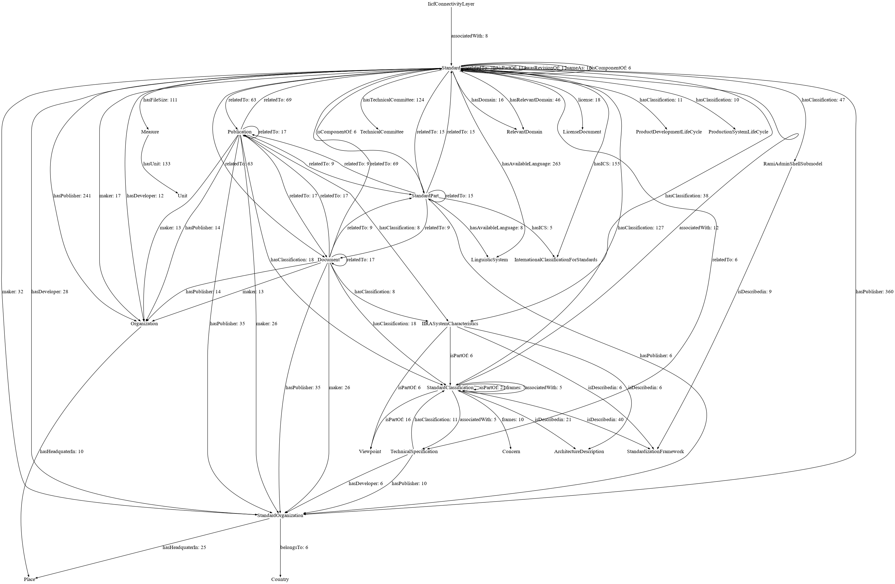
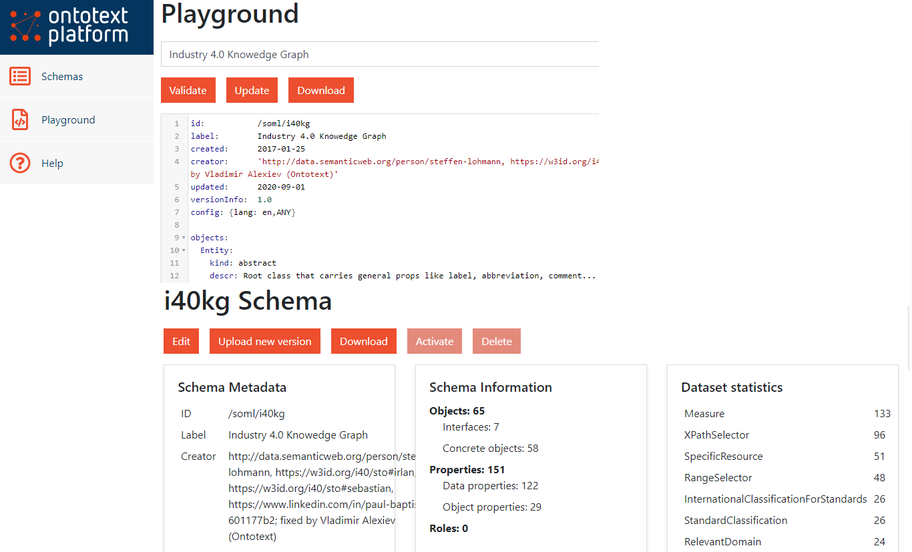

# Intro

- Hi, my name is Vladimir Alexiev and I'm Ontotext's Chief Data Architect.
- Miroslav Chervenski who is the Ontotext Platform Product Manager also contributed to this presentation.

In our work with Industry data, we have researched a number of industrial data standards.
This presentation is an intro to the Industry 4.0 Knowledge Graph by Fraunhofer IAIS and how we used the Ontotext Platform for simplified access and exploration of this KG.

Key resources (more links further in the slides):

- My publications: <http://rawgit2.com/VladimirAlexiev/my/master/index.html>
- This presentation: <http://rawgit2.com/VladimirAlexiev/my/master/pres/20200908-i40kg-semantics/Slides.html>
- Industry 4.0 KG main visualization: <http://i40.semantic-interoperability.org/>
- Ontotext Platform documentation: <http://platform.ontotext.com/>
- Try the GraphQL queries: <http://platform-test.ontotext.com/graphiql/> (to appear shortly)

# Industry Standards

- Numerous "traditional" standards for design, manufacturing, automation, control, quality etc
- New and upcoming standards for Industry 4.0, digital twins, Industrial IoT, asset management, etc
- The standards landscape is large and puzzling, how can one understand it?

Standard classification frameworks:

- [Current Standards Landscape for Smart Manufacturing Systems](http://dx.doi.org/10.6028/NIST.IR.8107), NISTIR 8107, NIST, 2016-02
- [The Industrial Internet of Things. Volume G1: Reference Architecture. IIRA v1.9](https://www.iiconsortium.org/IIRA.htm), Industrial Internet Consortium, 2019-06
- Reference Architectural Model Industrie 4.0 (RAMI 4.0), German Electrical and Electronic Manufacturers' Association (ZVEI)
- Asset Administration shell, German Electrical and Electronic Manufacturers' Association (ZVEI)

::: notes

Standards have always been very important in the industrial society. In addition to old established standards, there are now new upcoming standards for the digitization of industry (Industry 4.0).

How do you overview and understand them? Various classification frameworks have been adopted. Some of the important ones include NIST, IIRA, RAMI and Asset Shell.

Asset Shell is also a methodology/idea about integrating various standards in one "shell" using semantic technologies.

:::

# Industry 4.0 Knowledge Graph

(formerly Standards Ontology), Fraunhofer IAIS

- Describes semantically 320 standards, their classification, purpose, relations, etc
- Documentation: <https://i40-tools.github.io/I40KG/docs>
- Main visualization: <http://i40.semantic-interoperability.org/>
- Extra visualizations: <https://i40-tools.github.io/StandardOntologyVisualization/>
- [The Industry 4.0 Standards Landscape from a Semantic Integration Perspective](https://ieeexplore.ieee.org/document/8247584/), Emerging Technologies and Factory Automation (ETFA), 2017-09
- Classifies standards according to various methodologies and levels: Admin Shell Sub Model, Alliance of Industrial Internet Architecture Classification, Fiware Chapter, IDS RAM Layer, IIRA Functional Domain, ISA 95 Level, IVI Layer, IoT-A Perspective, NGSI Context Information Management API, Product Development Life Cycle, Production System Life Cycle, RAMI Hierarchy Level, etc

::: notes

Industry 4.0 Knowledge Graph
I40KG is an ontology and knowledge base (knowledge graph) by Fraunhofer IAIS that describes to some extent 320 standards and their classification, area of use, purpose, relations, etc

:::

## I40KG [Main Visualization](http://i40.semantic-interoperability.org/)

(This is a partial view, click for full version)


::: notes

The main view of I40KG shows the integrative role of RAMI 4.0 and Admin Shell, their various areas, and how they build upon existing areas in those areas.

- For example for Communication Layer, they use OPC UA (for M2M communication) and IEC 61784 (for industrial networks).
- Click on the title for a full version of the image!

:::

## I40KG Standards Classification

[Standards Classification visualization](https://i40-tools.github.io/StandardOntologyVisualization/views/chart.html): "progressive zoom"


::: notes

A great feature of I40KG is its elaborative (progressive) classification. (Follow the direction of the red arrows).

- On the top level are about 10 framework architectures or classification initiatives. 
- On the middle level, eg the NIST initiative covers Modeling, Production model data, Production lifecycle management, etc.
- On the lowest level, eg Modeling includes standards like ASME Y14.41, IEC 81714, etc

:::

## I40KG Concerns

- Addresses about 160 Concerns

AI AccessPolicy Access_Rights_for_IoT-Cloud Accountability Actuation Adaptability Agility Anonymity AssetManagement Authentication Authorization Auto_Scaling AutonomousCommunication AutonomousConfiguration Availability Awareness Bandwidth BigDataApplications BusinessContext BusinessProcessManagement BusinessTransactions BusinessValue CardinalityOfDataSources CardinalityOfParticipants Certification CloudComputing Communication ComplexEventProcessing Compliance Confidentiality Connectivity ConstrainedDevices ContextAwareness CostEfficiency CrossDomainIdentityManagement Customization DataAccess DataAccessControl DataAggregation DataAnalytics 

...

ServiceChoreography ServiceComposition ServiceDeployment ServiceDescription ServiceDiscovery ServiceIsolation ServiceLevelAgreements ServiceLifecycleManagement ServiceOrchestration ServiceSelection Service_Recovery Software_Updates SpatialModeling StreamProcessing SyntacticInteroperability SystemEvolution SystemRecovery ThingDescription ThingMobility ThingRepresentation TimeSynchronization Trustworthiness Unicast UnreliableNetwork UserInteraction UserPreferences VendorLockin VirtualEntity

::: notes

"Concerns" are various areas or topics relevant to industry digitization (eg AI, access rights, adaptability, etc).
I40KG covers (well, to some extent) **160 concerns**, will you believe that?

:::

## I40KG Model (Described)


So, how do we use this wealth of semantic data? We need to understand its model: what ontologies it uses and how they are put together.

- The paper [The Industry 4.0 Standards Landscape from a Semantic Integration Perspective](https://ieeexplore.ieee.org/document/8247584/) at ETFA 2017 provides a good description, and the basic data looks like this.

## I40KG [Model (Actual)](img
/sto-graph-ge5.png)

Relations between classes with >=5 instances (click for large version)



::: notes

In reality, the data is a lot more complex.

- If you analyze all relations between classes, there are 300 such (domain-property-range). Here we depict relations with >=5 instances; there are 78 such.
- Note: attributes are not even depicted.
- Control-click on the title for a large version of the diagram.

:::

# Exploring with the Ontotext Platform

- Made various fixes to ontology (eg duplicated prop definitions, redundant props) 
  and data (eg `dbr:_Arizona` shouldn't have leading underscore)
- Generated [Semantic Object (SOML) Model](http://platform.ontotext.com/soml) from the ontology with [owl2soml](http://platform.ontotext.com/soml/owl2soml.html) (see [github](https://github.com/VladimirAlexiev/soml/tree/master/owl2soml/)): Schema>Create wizard


::: notes

The [Ontotext Platform](http://platform.ontotext.com) gives us an easier way to explore: GraphQL.

- But before that, we need to make a Semantic Object model schema (SOML).
- We first generate a draft schema from the ontology using a tool called **owl2soml**, which is embedded in the Workbench in the form of a wizard

:::

## SOML Schema

Made a number of additions and fixes, then Activated:



::: notes

We made a number of additions and fixes, eg

- **lang: en,ALL** to return only one exemplar of multi-valued labels (preferring English),
- removing almost all prefixes from GraphQL names for easier consumption (eg **associatedWith** instead of **dul:associatedWith**),
- adding [virtual inverses with inverseAlias](http://platform.ontotext.com/soml/properties.html#inverses) for bidirectional graph navigation,
- binding all useful props to classes (several are in an abstract root class Entity),
- removing **max: inf** cardinality from several props since it's more expensive to query,
- etc

:::

## GraphQL Query 1: Standards and Classifications

- The Platform uses the SOML definition to generate GraphQL schema, query and mutation framework, transpile to SPARQL, 
  format results as JSON, generate SHACL for validation, etc.
- GraphQL queries practically write themselves! (Due to schema introspection)

Eg "give me standards that have both International Classification of Standards (`hasICS`)
and some classifications that have both `isDescribedin` and `associatedWith` relations"

```graphql
{
  standard(where:{hasICS:{} 
      hasClassification:{isDescribedin:{} associatedWith:{}}} limit:10) { 
    label{value}
    hasPublisher{orgName{value}}
    hasICS{title{value}}
    hasClassification{id
      isDescribedin{id}
      associatedWith{id}
    }
  }
}
```

::: notes

To understand this query, you need to look at the diagram of the data, and know two things:

- empty brackets in `where` mean **exists**,
- `{value}` is needed to get to the string value of a `langString`. (STO has tagged all strings as `@en`, I guess in hopes to one day expand to the whole world!).

If you play with GraphiQL, you may agree that queries nearly "write themselves". You need a fairly precise schema though:

- Eg here I've put too many props in Entity (eg abbreviation, label, license) while in actuality some appear at more specific classes.
- So these props are offered for most entities, which "pollutes" the editor suggestions a bit.

:::

## GraphQL Result 1: Standards and Classifications

(Brackets compressed and empty arrays skipped for brevity)

```json
"standard": [{
 "label": {"value": "IEC 60839-5-2:2016"},
 "hasPublisher": [{"orgName": {"value": "International Electrotechnical Commission"}}],
 "hasICS": [{"title": {"value": "Alarm and warning systems"}}],
 "hasClassification": [
   {"id": "https://w3id.org/i40/sto#RamiControlDevice",},
   {"id": "https://w3id.org/i40/sto#RamiFieldDevice",},
   {"id": "https://w3id.org/i40/sto#RamiCommunicationlayer",},
   {"id": "https://w3id.org/i40/sto#AsSecurity",
     "isDescribedin": [{"id": "https://w3id.org/i40/sto#AdministrationShell"}],
     "associatedWith": [
       {"id": "https://w3id.org/i40/sto#BdvaCyberSecurityTrust"},
       {"id": "https://w3id.org/i40/sto#DtpSecurityPrivacy"},
       {"id": "https://w3id.org/i40/sto#FiwareSecurity"}]}]}
```

"`IEC 60839-5-2` by the IEC is about `Alarm and warning systems` and is classified in the areas
`RamiControlDevice, RamiFieldDevice, RamiCommunicationlayer`;
and `AsSecurity` (described in `AdministrationShell`, 
associated with `BdvaCyberSecurityTrust, DtpSecurityPrivacy, FiwareSecurity`)

::: notes

You may notice that the result shape (nesting) exactly matches the query shape. 

- (Well, I've compressed the result to fit it on the page, but if you look in GraphiQL, you'll see that's true).

IEC 60832 is about alarm systems, so all its classifications (security) appear to be correct.

:::

## GraphQL Query 2: Standards and Licenses

Let's find entities (eg standards) and their licenses:

```graphql
{entity(where:{license:{}}) {id
  license{id}}}
```

We get results, plus an error:

```json
"errors": [{
  "message": "Found 2 values for single-valued field 'license' from 'Entity'",
  "path": ["entity", 3, "license"],
  "locations": [{"line": 3, "column": 3}]}],
```

Turns out that `IEC_62541` is dual-licensed under `GPLv2` and `OpenLicenseDocument`.
So our assumption that entities have a single license (removing `max:inf`) is not 100% true.

::: notes

Here we're looking for entities and their licenses.

- I assumed entities have just one license so removed `max: inf` (more expensive to query), but it turns out the assumption is not 100% right (only 95% or so).
- GraphQL returns a very precise error, which allows us to find the exact query spot, and the exact data record that caused the error.

:::

## GraphQL Query 3: ISO 15926

ISO 15926, in development for nearly 30 years, has been touted as the "lingua franca" for global interoperability.

Let's find the classifications and standards that it is related to:

```graphql
{standard(where:{label:{value:{EQ:"ISO 15926"}}}) {
  comment{value}
  hasClassification{id}
  relatedTo {
    id
    label{value}
    comment{value}}}}
```

Response:

```json
"standard": [{
  "comment": {"value": "Industrial automation systems and integration -- Integration of life-cycle data for process plants including oil and gas production facilities."},
  "hasClassification": [
    {"id": "https://w3id.org/i40/sto#RamiProduct"},
    {"id": "https://w3id.org/i40/sto#RamiIntegrationLayer"},
    {"id": "https://w3id.org/i40/sto#AsConfiguration"},
    {"id": "https://w3id.org/i40/sto#AsEngineering"},
    {"id": "https://w3id.org/i40/sto#ProductLifeCycleManagement"}
  ],
  "relatedTo": [
    {"id": "https://w3id.org/i40/sto#DIN_SPEC_16592",
      "label": {"value": "DIN SPEC 16592"},
      "comment": {"value": "Combining OPC Unified Architecture and Automation Markup Language."}},
    {"id": "https://w3id.org/i40/sto#IEC_62541",
      "label": {"value": "IEC 62541"},
      "comment": {"value": "OPC Unified Architecture (OPC UA) is an industrial M2M communication protocol..."}}

```

## ISO 15926 Complexity

The complexity of ISO 15926 is difficult for most people to master.

Its approach to ontology modeling comes from the [BORO method](https://en.wikipedia.org/wiki/BORO) that uses:

- An Extensional (rather than linguistic) Criterion of Identity
- Four-dimensional modeling: every entity evolution or state is represetned as another temporal part
- Non-well-founded Sets and Powersets
- Every relation is represented as a reified `Relationship` (diamond nodes in the diagram below)

Eg here's how to represent the allowed range of a parameter of some entity (tag or equipment):


::: notes

This is template [CL-INDPTY-200](https://15926.org/home/templatespecs/CL-INDPTY-200.xml) **ClassOfIndividualHasIndirectPropertyWithBoundingValues**
with definition "Any member of `EssentialType` class `hasPossessorType` has a `hasIndirectPropertyType` with a range of `valLowerBound` to `valUpperBound` `hasScale`".

- It has 5 input parameters held by an N-ary relation named after the template name
- This is expanded to about 23 nodes and 100 triples
- Templates make it easier to **produce** the multitude of triples specified by ISO 15926
- But it's not clear whether templates simplify **querying** unless you use the N-ary relation...
- ... Which begs the question why you need the template expansion

:::

## GraphQL Query 4: Concerns

I40KG includes a number of 200 "concerns" i.e. topics relevant to Industry (eg AI, DataAnalytics, etc).

```graphql
{concern{
  id 
  label{value}}}
```

Let's find which classifications are related to which concerns.
We use prop `frames` defined as "A relation specifying that a vewpoint regards a Concern":

```graphql
{standardClassification(where:{frames:{}}) {
  id
  frames{id}}}
```

Similarly, property `hasTargetConcern` connects Standards to Concerns:

```graphql
{standard(where:{hasTargetConcern:{}}) {
  id
  hasTargetConcern{id}}}
```
