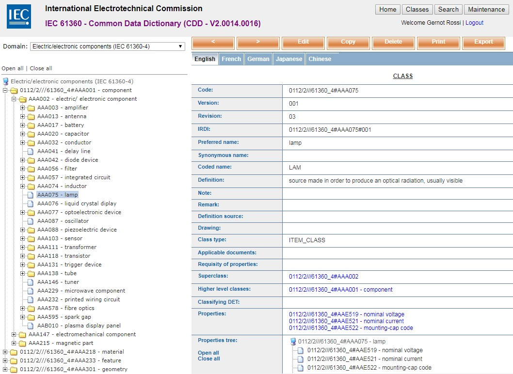
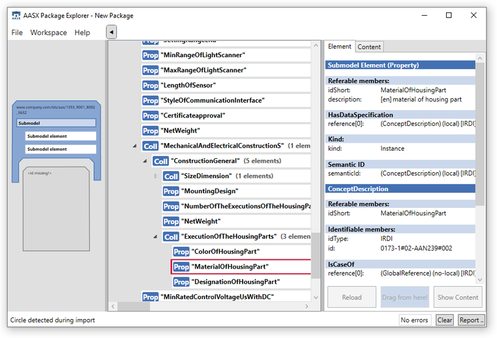

# Motivation

We discuss various considerations for representing ECLASS product info as RDF.

- Why is it important to put ECLASS online on the web of data? 
  - Use Cases must drive representation principles (see below)
  - Competency Questions are also important (none discussed yet)
- Why RDF?
  - Semantic data integration has proven itself as the most sclable method for Enterprise Information Integration
  - Huge recent interest in Enterprise Knowledge Graps
  - Replies the Web Architecture: some simple Semantic Web Principles and Data Decentralization
- Unfortunately, as far as I can see, most Industry data still relies on Data Copying (or Exchange)

## Ontotext Presentations

Somewhat related Ontotext presentations:

- [Exploring Industry 4.0 Standards with the Ontotext Platform](http://rawgit2.com/VladimirAlexiev/my/master/pres/20200908-i40kg-semantics/Slides.html), Semantics 2020 webinar, Sep 2020
- [Practical Semantic Modeling, SPARQL, RDF Shapes, IoT/WoT/UoM](http://rawgit2.com/VladimirAlexiev/my/master/pres/20171025-Practical%20Semantic%20Modeling,%20SPARQL,%20RDF%20Shapes,%20IoT-WoT-UoM%20(201710).pptx), Ontotext Training, 80 Slides, Oct 2017
  - I now made an update on Units of Measure (available on request)

## Crucial Questions

Crucial Questions to consider when designing ECLASS RDF.

Together with the use cases and competency questions, they should provide a frame of reference 
for making decisions that are **usable, consistent, viable in the long term**.

- Data Copying vs Data Decentralization
  - Decentralization and Semantic Web Principles
  - Data Copying
- Ontological Realism vs Idiosyncrasy
  - Step-by-Step Guide to Ontology Development
- Closed vs Open Data Ecosystems
- Local vs Global Thinking

While I have my doubts that the ECLASS Association will be able to soon subscribe to these principles, I believe they are important considerations to keep in mind.

### Semantic Web Principles

Semantic Web and Linked Data are based on several simple principles:

- Everything has a IRI (URL): from a huge enterprise, to its plants, to every machine and asset, to each document and data spec, to the smallest measurement or data field.
- The data model is simple (abstracted). It's a semantic graph made of triples (relations that are graph edges, and attributes that are literal values). 
- RDF is flexible: can be used without or with schemas; schemas stored the same as data, can always be extended, without requiring system redeployment or data migration.
- In appropriate settings, a data consumer can rely that data about any entity will be returned when its IRI is dereferenced.

### Decentralization

Data Decentralization (Distribution)

- each party holds its data and allows other parties to access it at any time (as appropriate, controlled by license agreements and access rights).
- an important technological element of Data Sovereignty, as propounded by the International Data Spaces Association.
- better approach to cross-enterprise data integration, as evidenced by boom of Semantic Data Integration and Enterprise Knowledge Graphs.
- a system will often want to make a local copy of global data (caching), but this is engineering not data architectural principle

#### Data Copying

As far as I can see, most Industry data still relies on Data Copying (or Exchange). 

- Copies of data are transferred between parties
- Global IRIs are sparingly used and don't have "first class citizen" status
- There is no assumption that the up-to-date Version of Record of a fine-granularity piece of data will always be found at a certain IRI.
  - ECLASS distributions,
  - BMEcat transfers,
  - IEC CDD unavailability of IRDIs for global resolution,
  - RAMI/AAS examples of copying other data into an admin shell, etc.
- I believe that ECLASS RDF should break out of this tradition and tackle directly Data Distribution.
- Exception: ISO 15926 (oil & gas) and its **Reference Data Libraries**

### Ontological Realism vs Idiosyncrasy

- an ontology should be analogous **not to a data model**, but rather to a **reality model**
- ontological realism positions the resulting ontologies as best candidates for serving as **common models of all the data sources within a complex information ecosystem**
- realist ontologies enable **cross-enterprise-wide data integration** by removing a layer of **perspective from each of the several data sources involved**

Compare:

- The **real world** of economy/manufacturing has products, product classes, properties, manufacturers, documents, spec sheets, etc 
- The **PLIB (OntoML/POM) world** of idiosyncratic information artifacts has classification classes, characterization classes, application classes, blocks, aspects, etc.

#### Step-by-Step Guide to Ontology Development (excerpts)

- Identify the primary bodies of data your ontology will be used to annotate.
- Maximize the ability of your ontology to address these primary tasks
  - but without detriment to its ability to address secondary uses not yet identified.
  - (secondary uses are often significantly more important than primary uses, and almost always what guarantees the enduring value of an ontology)
  - ensure that the terms and definitions in your ontology are of broad understandability and validity
  - (rather than being understandable and valid only by your immediate collaborators and only when used in relation to your currently available data)
- Do not confuse information artifacts with the reality they denote
  - Distinguish explicitly between each real entity and the information about it
  - Eg `gtin` is a prop of ProductModel but `gln` is a prop of an Organization

###  Open vs Closed Data Ecosystems

ECLASS is a very closed data environment: it does not reuse data by anyone else. Eg:

- Although it uses same/similar data model as IEC CDD, it does not use any IEC data, not even IEC Units of Measure.
- It defines various lists that **should not be the business** of ECLASS, eg: Countries, Languages, Colors, Units of Measure, etc

Why should ECLASS care about this?

- Reusing data representations and data items created by others may reduce the work of ECLASS.
  - (I acknowledge that this does not hold in all cases because sometimes it's easier to produce data in a closed environment.)
- Reusing data may make it easier for ECLASS users to consume ECLASS:
  - ECLASS product data is only one kind of data in an enterprise IT environment
  - There is a large number of ontologies relevant to the use cases that ECLASS cannot interoperate with
  - That includes IoT/WoT, schema.org, sensors, electrical, green energy, BIM, etc, etc

### The Web: Open Innovation

W3C standards are fully open:

- Preceded by UCR (Use Case Requirement specifications) that are gathered through wide consultation
- Openly developed (usually on github), anyone can submit issues
- Free of patent claims
- Openly accessible throughout all draft stages
- Include machine-readable artefacts: [All your spec are belong to us - irrigating dev resources from specs](https://www.youtube.com/watch?v=r9AXrFoFEg4)
- Include conformance testing suites and harnesses
- Models (ontologies), test suites and test results (EARL ontology) are all expressed in machine-readable way (usually RDF)
- Before accepted as recommendation, minimum 2 conforming implementations are needed. Implementation Report is generated from EARL RDF

### The Web Invites Wide Participation

- Anyone can make content and link to other content
- World Wide Web of content (web) and Global Giant Graph of data (semantic web)
- Working Groups and Community Groups
- "Permission-free innovation"
- Unfortunately, big "internet properties" have become content monopolists: so TimBL started the [Solid](https://en.wikipedia.org/wiki/Solid_(web_decentralization_project)) web decentralization project

### ISO and IEC: Closed Standards

ISO and IEC standards are closed:

- Eg [ISO 13584-32:2010](https://www.iso.org/obp/ui/#iso:std:iso:13584:-32:ed-1:v1:en) Industrial automation systems and integration — Parts library — Part 32: Implementation resources: OntoML: Product ontology markup language
- Development by a close expert group
- Long and bureaucratic development and update cycles
- Delivered as PDF with few machine-processable artefacts
- Costs 200 CHF: few developers will bother to pay this to get it

### ISO and IEC: Positive Aspects

- [IEC CDD](https://cdd.iec.ch/CDD/iec61360/iec61360.nsf) is online, open (but not quite), update a lot more frequently
- PLIB is well described at ECLASS wiki: [ISO 13584-32 ontoML](https://wiki.eclass.eu/wiki/ISO_13584-32_ontoML) and [Conceptual Data Model](https://wiki.eclass.eu/wiki/Conceptual_data_model); but not official/comprehensive

"ISO/IEC are for professional use, so money is not a problem"

- Closeness is the problem. It reduces the reach, scope and adoption of engineering data
- Eg "A Critical Assessment of ISO 13584 Adoption by B2B Data Exchange Specifications" (Martin Hepp, ICCE 2006)
- Openness is **the major reason** for the success and penetration of the web

### PLIB and POM: Not Open Data

- [IEC CDD License](https://cdd.iec.ch/CDD/iec61360/iec61360.nsf/License?openPage) is "kinda open but not really"
  - YOU may not sell, lend, lease or distribute to a third party, reproduce or otherwise exploit, whether commercially or not, the total database or a significant portion of it, to which this LICENSE relates .
  - YOU may copy the database only for a restricted and confidential internal use and this LICENSE exception is also restricted to other employees for their internal or external use within YOUR organization.
  - Only partial dumps available
- ECLASS is not available online in machine-readable form
  - ECLASS is paid and **that is fine**: "Open" is not the same as "Free"
  - But the Association must consider carefully who are its paying customers and what should be its licensing model
  - I think manufacturers should pay, but not eCommerce or WoT developers

## Local vs Global Thinking

- PLIB & ECLASS define everything locally
- Internal data items are not intended for online access (eg IRDI Versioning)
- External LOD is never reused, although readily available, eg
  - Countries and other Places
  - UoM
  - Languages
  - MIME types
  - Materials
  - Manufacturers/suppliers...

## Use Cases

- Product libraries: PLIB/POM, ECLASS/IEC CDD (innate)
- Web of Things TD: online description and control (original case posed by ECLASS Association)
- Online product catalogs (BMEcat conversion shown recently)
- schema.org (GoodRelations): eCommerce integration
- Industrie 4.0: RAMI 4.0, Admin Shell, OPC UA...

Not yet discussed/confirmed:

- PIM/PLM/supply chain management
- [GS1 Digital Link](https://www.gs1.org/standards/Digital-Link/): online consumer information from GTIN
- Online/smart documentation

### Product Libraries

- ECLASS is based on the ISO 13584 - IEC 61360 PLIB standard
  - Uses the ISO 13584-32 ontoML Conceptual data model
- A newer rendition of the same ideas is IEC 62656
  - Uses POM (Parcelized Object Model), which is an "ensemble of spread sheets"
- Considerable investment by:
  - Standardization bodies, especially IC
  - The engineering/manufacturing communities

#### IEC 62656 POM


#### PLIB/POM Product Library Examples 

- ECLASS (100 orgs, German/international)
- IEC 62474: Material Declarations for Electrotechnical Products
- [IEC 61360: Common Data Dictionary](https://cdd.iec.ch/CDD/iec61360/iec61360.nsf/TreeFrameset?OpenFrameSet) 
  - IEC 13584 Measuring instruments (not publicly browseable)
  - IEC 60721 Environmental declaration (not publicly browseable)
  - IEC 61360 Electric/electronic components
  - IEC 61987 Process Automation
  - IEC 62683 Low Voltage switchgear
  - IEC 62720 Units of Measure (not publicly browseable)
  - IEC TC47 Electro-electronic components (not publicly browseable)
  - ISO 23584 Optics (not publicly browseable)
- NAMUR (118 orgs): plant devices
- PFI (130 orgs, French)
- ECALS (100 orgs, Japan, JEITA)
- RosettaNet

#### POM Example: IEC CDD



#### IEC CDD Expansion Plans


### Web of Things TD

- This was the original case posed by the ECLASS Association
- WoT aims to unify/reduce fragmentation of IoT protocols/data formats
  - Follow the Web Architecture
  - Standard complementing building blocks (e.g., metadata and APIs) 
  - Enable easy integration across IoT platforms and application domains
  - Just like `http` unified access to previously disparate protocols/resoures like `ftp, gopher, nnews`...
  - WoT IG innovates, WoT WG standardizes
- WoT TD ([spec](https://www.w3.org/TR/wot-thing-description/), [ontology](https://www.w3.org/2019/wot/td)) allows online description and control of IoT devices
  - description in JSONLD and other RDF formats
  - controls: properties (eg brightness), actions (turn on/off), events (overheating)
  - hypermedia **affordances**: TD includes not just static and dynamic data, but also controls URLs
  - allowance for constrained devices (HTTPS -> COAP, RDF -> EXI)

#### WoT TD Templates

[TD Templates](https://www.w3.org/TR/wot-thing-description/#thing-templates): description for a class of Things (entire group of Things).

WoT spec posits these use cases:

- management of multiple Things by a cloud service.
- simulation of devices/Things that have not yet been developed.
- common applications across devices from different manufacturers that share a common Thing model.
- combining multiple models into a Thing.

Elaborating the last case:

- You can't expect a Smart Bulb to carry its own Spec Sheet (not enough memory!)
- So a Thing uses Template to link to its detailed product props:
- Bulb links to a manufacturer Catalog
- Catalog links to ECLASS product/prop definitions
- The data is distributed functionally
- Yet, a WoT server should assemble all of it and present as a single TD

#### WoT TD Questions

There are many questions/details to be aligned, most importantly:

- ECLASS is about describing the props, parts and aspects of products
- How to reflect those in WoT TD? It takes a simpler approach
- How to use those to systematically construct TD Affordances?
- Eg if a Lamp uses a Cardinality blocks Switch 1, Switch 2 and Bulb 1, Bulb 2, does that mean I can systematically have:
  - action <http://my-house/room1/lamp/switch/1/toggle>
  - action <http://my-house/room1/lamp/switch/2/toggle>
  - prop   <http://my-house/room1/lamp/bulb/1/brightness>
  - prop   <http://my-house/room1/lamp/bulb/2/brightness>

### Online Product Catalogs

- A crucial current use of ECLASS is in product catalogs (eg XML based: BMEcat, ISO)-
- I'm very glad this is included in scope (the BMEcat->RDF conversion shown recently)
- ECLASS RDF representation without guidance on catalog RDF representation would be pointless
- Web-accessible (online) and semantic catalogs are crucial for other use cases (WoT Templates, schema.org)
- The design of RDF catalogs **conforming** to those cases is a prerequisite for ECLASS RDF

### schema.org

- schema.org has much wider scope than marking up web pages
- After Marting Hepp's work (GoodRelations), schema.org is widely used for eCommerce
  - A lot is for B2C (buying cars, products, tickets; booking restaurants)
  - But I imagine some is for B2B integration
- [Web Data Commons crawl 2019-12](http://webdatacommons.org/structureddata/2019-12/stats/stats.html) found 44B triples about 14B entities at 934M pages from 12M web domains
- The majority of that data is expressed in schema.org

#### schema.org eCommerce 

[Web Data Commons crawl 2019-12](http://webdatacommons.org/structureddata/2019-12/stats/stats.html): a huge chunk is eCommerce data.

- Search `Top Classes` then `Show top values by entity count`, 6x
  - Extractor html-microdata
    - schema:Product (329,320,312 Entities)
    - schema:Offer (298,566,693 Entities)
  - Extractor html-embedded-jsonld (etc)
    - schema:Offer (43,207,520 Entities)
    - schema:Product (42,026,698 Entities)
- Could also look at `Top Properties`
  - Extractor html-microdata
    - schema:Product/name (309,798,605 Entities)
    - schema:Offer/price (270,064,408 Entities)
    - schema:Offer/priceCurrency (252,327,550 Entities)
    - schema:Product/offers (239,419,097 Entities)
    - schema:Product/image (234,121,189 Entities)
    - schema:Product/url (160,633,419 Entities)
    - schema:Product/description (142,279,305 Entities)
    - schema:Offer/availability (132,764,096 Entities)

### Industrie 4.0

Cornerstones of the German Industrie 4.0 initiative:

- Reference Architectural Model for Industry 4.0 (RAMI) 
- Asset Administration Shell (AAS)

Intended to unify/incorporate/extend previous Industrial IoT models including AutomationML, OPC UA, IEC CDD, and ECLASS.

Spec "Details of the Asset Administration Shell Part 1" (Version 2.0.1 2019-11) includes the following semantic parts in Annex G 

- "ii. RDF Data Model for the Administration Shell" (p270-315): an OWL ontology with namespace <http://admin-shell.io>, saved as `aas-ontology.ttl`
- "iii. RDF Schema for the Administration Shell"  (p316-333): a SHACL shape definition
- "iv. RDF Example of a motor", saved as `RDF-example-motor.ttl`
- (I've extracted them, added prefixes and sections for easier reading)

#### AAS Explorer and Import

The AAS Package Explorer (AASX) can import the following formats to AAS:

- AutomationML
- OPC UA
- IEC CDD
- BMEcat
- i4aas
- CSV
- ECLASS as presented at [ECLASS in Admin Shell](https://www.eclass.eu/anwendung/verwaltungsschale.html)

#### AASX ECLASS Import



#### RAMI/AAS Problems

Relies on copying, not web data distribution; blank nodes not global IRIs:

```ttl
<http://i40.customer.com/type/1/1/7A7104BDAB57E184> a aas:Submodel;
  aas_referable:idShort "TechnicalData";
  rdfs:label "TechnicalData";
  aas_referable:category "CONSTANT";
  aas_identifiable:identification <http://i40.customer.com/type/1/1/7A7104BDAB57E184>;
  aas_hasSemantics:semanticId [
    a aas:Reference;
    aas_reference:key [
      a aas:Key;
      aas_key:index "0"^^xsd:integer;
      aas_key:type aas_keyElements:GLOBAL_REFERENCE;
      aas_key:local "false"^^xsd:boolean;
      aas_key:value "0173-1#01-AFZ615#016";
      aas_key:idType aas_identifierType:IRDI]];
  aas_hasKind:kind aas_modelingKind:INSTANCE;
  aas_submodel:submodelElement [
    a aas:Property;
    rdf:subject <http://i40.customer.com/type/1/1/7A7104BDAB57E184/MaxRotationSpeed>;
    aas_referable:idShort "MaxRotationSpeed";
    rdfs:label "MaxRotationSpeed";
    aas_property:category aas_category:PARAMETER;
    aas_hasSemantics:semanticId [
      a aas:Reference;
      aas_reference:key [
        a aas:Key;
        aas_key:index "0"^^xsd:integer;
        aas_key:type aas_identifiableElements:CONCEPT_DESCRIPTION;
        aas_key:local "true"^^xsd:boolean;
        aas_key:value "0173-1#02-BAA120#008";
        aas_key:idType aas_identifierType:IRDI]];
    aas_hasKind:kind aas_modelingKind:INSTANCE;
    aas_key:value "5000"^^xsd:integer];

<http://i40.customer.com/type/1/1/F13E8576F6488342/MaxRotationSpeed>
  a aas:ConceptDescription;
  aas_referable:idShort "MaxRotationSpeed";
  rdfs:label "MaxRotationSpeed";
  aas_referable:category "PROPERTY";
  aas_identifiable:identification [
    aas_identifier:id "0173-1#02-BAA120#008";
    aas_identifier:idType aas_identifierType:IRDI];
  aas_identifiable:administration [
    a aas:AdministrativeInformation;
    aas_administrativeInformation:revision ""];
  aas_conceptDescription:content [
    a dataspec_iec:DataSpecificationIEC61360;
    dataspec_iec:preferredName "max. Drehzahl"@de;
    dataspec_iec:preferredName "Max. rotation speed"@en;
    dataspec_iec:unit "1/min";
    dataspec_iec:unitId [
      a aas:Reference;
      aas_reference:key [
        a aas:Key;
        aas_key:index "0"^^xsd:integer;
        aas_key:type aas_keyElements:GLOBAL_REFERENCE;
        aas_key:local "false"^^xsd:boolean;
        aas_key:value "0173-1#05-AAA650#002";
        aas_key:idType aas_identifierType:IRDI]];
    dataspec_iec:datatype "INTEGER_MEASURE";
```

## Non-Functional Requirements

Use cases outline the information domains that ECLASS RDF must relate to.

But that's not the whole story, we also need to detail:

- How to get the data? Hosting, Serving, Resolution...
- What would consumers want to search for and get? Competency Questions

### How to Get The Data

- Hosting/serving of RDF in a semantic database
  - Scope: ECLASS and manufacturer product catalogs (as a minimum)
- Semantic resolution
- Content negotiation
- Long-term IRI stability
- Protocols: HTTP/HTTPS (usual), COAP (for constrained devices)
- Semantic formats: Turtle, JSONLD (usual), EXI (for constrained devices)
- Licensing/access control

### Competency Questions

Defined Competency Questions are the best way to guide ontology development

- To avoid going off on a tangent and designing too much of what's not needed
- In our case we start from a well-developed information model, so we should capture all of it

But we still need to answer:

- What will consumers want to search for or search by?
  - Eg are these legit queries "find red products", "find products shorter than 15cm"?
  - Are these easy to answer? I haven't seen many/any sub-properties in ECLASS?
  - Eg there isn't a single "height", there's also "height of enveloping body"
  - That applies to "enveloping body - cylinder" and "enveloping body - box"
  - There are different props that relate to those Polymorphic blocks
- What data do they want to get? Tradeoff:
  - Don't get too much (eg only definitions of props actually used in a product)
  - Don't get too little (to avoid too many network round-trips)

# Related Work

Various previous works are relevant for the ECLASS effort.

- Martin Hepp: GoodRelations, product classifications, product catalogs
- schema.org Product classes: relevant for all web sites and more; simple pragmatic modeling
- Application Profiles and RDF Shapes
- XSD data types: everyone uses them (even schema.org that declares its own datatypes)
- Unit of Measurement Ontologies: 3 are widely established and used

## Martin Hepp 

Martin Hepp's work on semantic web approaches to eCommerce is well-known and established:

- GoodRelations (products, offers, prices) is the foundation of eCommerce in schema.org
- The "Gen/Tax" distinction between strict class hierarchies and vaguer taxonomic (classification) hierarchies
- Conversion of a number of product ontologies to RDF/OWL, although in a simplistic way

I'm sure ECLASS has taken into account his experiments, but we can turn back to his work for more advice and guidance.
Below I list Martin's papers that are relevant to this effort.

Comparison/Overview of product description vocabularies:

- Product Representation in the Semantic Web (Working Paper 2004-04)
- Content Metrics for Products and Services Categorization Standard (EEE 2005)
- A Quantitative Analysis of ECLASS, UNSPSC, eOTD, and RNTD Content, Coverage, and Maintenance (ICEBE 2005)
- The True Complexity of Product Representation in the Semantic Web (ECIS 2006)
- A Quantitative Analysis of Product Categorization Standards: ECLASS, UNSPSC, eOTD, and RNTD (KAIS 2007)

### Martin Hepp (2) 

Conversion Methods:

- SKOS2OWL- An Online Tool for Deriving OWL and RDF-S Ontologies from SKOS Vocabularies (ISWC 2009 poster)
- A Methodology for Deriving OWL Ontologies from Products and Services Categorization Standards (ECIS 2005)
- Representing the Hierarchy of Industrial Taxonomies in OWL- The gen-tax Approach (ICSW 2005)
- Products and Services Ontologies- A Methodology for Deriving OWL Ontologies from Industrial Categorization Standards (IJSWIS 2006-01)
- GenTax- A Generic Methodology for Deriving OWL and RDF-S Ontologies from Hierarchical Classifications, Thesauri, and Inconsistent Taxonomies (ESWC 2007)
- Alignment of Ontology Design Patterns- Class As Property Value, Value Partition and Normalisation (OTM 2012)

Specific Product Classifications:

- PCS2OWL- A Generic Approach for Deriving Web Ontologies from Product Classification Systems (ESWC 2014)
- ProdLight- A Lightweight Ontology for Product Description Based on Datatype Properties (BIS 2007)
- Product Ontology website documentation

### Martin Hepp (3) 

ECLASS:

- ECLASSOWL- The Web Ontology for Products and Services (2010-04) website documentation
- Integrating Product Classification Standards into Schema.org- ECLASS and UNSPSC on the Web of Data (OTM 2017)
- ECLASSOWL- A Fully-Fledged Products and Services Ontology in OWL (ISWC 2005 Poster)
- Using BMEcat Catalogs as a Lever for Product Master Data on the Semantic Web (ESWC 2013)

ISO 13584 (PLIB):

- Ontologizing B2B Message Specifications- Experiences from Adopting the PLIB Ontology for Commercial Product Data (ICEBE 2006)
- A Critical Assessment of ISO 13584 Adoption by B2B Data Exchange Specifications (ICCE 2006)

## schema.org

Schema.org describes many real-world entities, is applicable in a wide variety of domains, and integrates data from a huge number of providers and domains

- It is used more and more often on actual eCommerce sites (see Use Case above)
- WoT efforts make a connection to schema.org, and use the same "low ontological commitment" as schema.org

### RDFS/OWL: High Ontological Commitment 

RDFS defines the properties `rdfs:domain` and `rdfs:range`

- These are strict and "prescriptive":
- According to RDFS semantics, every time the described property is used, the property subject resp. object gets the domain resp. range as type.
- This also makes these RDFS properties "monomorphic": they should take single values, otherwise the subject/object will get multiple types, which are usually not intended.
- Eg if you state that name is applicable to Person and Organization with the axiom `:name rdfs:domain :Person, :Organization`,
  entities with `name` will become **both** `Person` and `Organization`, which is an often made mistake.
- Ontology engineers overcome this problem by:
  - introducing abstract superclasses (e.g. `Actor` or even `Nameable`), 
  - using `owl:union` to make a disjunction of several classes, or 
  - using `owl:Restriction` to bind the property to the class locally. 
  
But all of these approaches complicate the ontology, increase "ontological commitment", and ultimately make ontology reuse harder.

### schema.org: Low Ontological Commitment 

To cope with web-scale integration of data, Schema uses properties `schema:domainIncludes` and `schema:rangeIncludes`

- These are advisory and "descriptive" (describe properties applicable to a class, without being exclusive)
- Therefore polymorphic: an axiom like `:name schema:domainIncludes :Person, :Organization` doesn't cause any unintended types to be inferred
- This approach has much lower "ontological commitment" and enables more flexible reuse and combination of different ontologies
- So it is appropriate in any data domain where data comes from a large number of sources
- Rather than using complicated OWL mechanisms, we prefer to use RDF Shapes to validate incoming data from data providers
- We used this mechanism for Company data, see the euBusinessGraph Ontology cited above
- It is also **used in the WoT Thing Description** ontology

### Schema.org Specific Classes

schema.org has several releant classes. Should be considered for reuse:

- `ProductModel`: A datasheet or vendor specification of a product (in the sense of a prototypical description).
- `Product`: Any offered product or service. For example: a pair of shoes; a concert ticket; the rental of a car; a haircut; or an episode of a TV show streamed online.
- `PropertyValue`: A property-value pair representing an additional characteristics of the entitity, e.g. a product feature or another characteristic for which there is no matching property in schema.org.
- `QuantitativeValue`: A point value or interval for product characteristics and other purposes.

Might be relevant:

- `ProductGroup`: a group of Products that vary only in certain well-described ways, such as by size, color, material etc.
- `EnergyConsumptionDetails`: the energy efficiency Category ("class" or "rating") for a product according to an international energy efficiency standard

### Schema.org Specific Props

schema.org also has some fixed product properties.
Can be useful if you decide to replace some IRDIs with named terms:

- `unitCode` which is either based on UNECE/UNCEFACT (eg `MTR`), can use a prefixed name (eg `ucum:um` for micrometers), or a URL (eg `qudt:Meter`)
- Links like `isAccessoryOrSparePartFor, isRelatedTo, isSimilarTo, isVariantOf, inProductGroupWithID, manufacturer`
- Identifiers like `gtin, mpn, nsn, productID, sku, identifier`
- Classification extensions like `additionalType, category`
- Characteristics like `model, brand, material, color, size, pattern, height, depth, weigth, width`
- Dates/events like `productionDate, releaseDate`

Extensions for particular product domains, eg Automotive, Financial, Hospitality.

- These add specific classes like `Vehicle, EngineSpecification` etc
- And add specific characteristics like `accelerationTime, cargoVolume` etc

## Application Profiles

Application profiles serve several related goals, see [W3C Profiles Guidance](https://w3c.github.io/dxwg/profiles/) adn the earlier [Guidelines for Dublin Core Application Profiles](http://dublincore.org/documents/profile-guidelines/)

- Document data models
- Describe data structure and validation rules in a machine-readable way
- Select amongst several closely related models
  - I think this should be used to implement the **ECLASS Basic/Advanced distinction**
  - A recent specification describes how such selection can be done in the HTTP protocol: [Content Negotiation by Profile](https://www.w3.org/TR/dx-prof-conneg/)
  - Similar to negotiation by content type (`Accept`) and language (`Accept-Language`)

### RDF Shapes{.nostretch .smaller}

RDF Shapes have emerged as the way to express application profiles in machine-readable way and to validate RDF.

- I cannot do them justice here, but we have a lot of experience with shapes
- I was a reviewer for the first Shapes book: [Validating RDF Data](https://book.validatingrdf.com/)
- The two major standards are SHACL and SHEX, and both have their strengths and weaknesses; in particular SHEX is much easier to edit
- Consider SHACLC (SHACL Compact), see [VladimirAlexiev/shaclc-mode](https://github.com/VladimirAlexiev/shaclc-mode) : compact writing, syntax highlighting, syntax checking, menu navigation


## RDF Literals and Datatypes

- RDF uses XSD datatypes, everyone uses them, and they have special support in RDF repositories and tooling
- `rdf:langString` puts the string and lang tag together in a literal.
  - IANA defines the structure and [register of lang tags](https://docs.google.com/spreadsheets/d/1M1yv9aBUmc-NyCJX69vOLUmH2uIglSwmDwgRgByI1AI/edit) (used widely on the web), and it has more components: `lang-Script-dialect-REGION`
- (Note: `rdf:XMLLiteral` and `rdf:HTMLLiteral` are also available for special purposes)
- A few custom datatypes are used, if they have special support: eg
  - `geo:asWKT` or `geo:asGML` for GeoSPARQL geometries (spatial indexing),
  - `cdt:ucum` for quantity literals, etc

## UoM Ontologies

Widely used lists:

- UNCEFACT Recommedation 20, which accommodates more exotic eCommerce units, like "pairs", "US barrels per day", etc
- UCUM, which handles decimal prefixes and has info on conversion factors

There are also about 10 ontologies:

- MUO, OBOE, OM 2, QU, QUDT 2.1, SWEET 3, UO+PATO, Wikidata, unitsOfMeasure, LINDT

## UoM Ontologies (2)

2 UoM ontologies are most promising and widely used:

- QUDT: sponsored by NASA, rich dimension analysis, conversion factors, links to a bunch of scientific disciplines, links to other UoM authorities
- LINDT UCUM: puts the number and unit in the same string:
  - Comparability, conversion and arithmetic operations on quantities (eg `"1 m"^^cdt:ucum + "100 cm"^^cdt:ucum`)
  - Unlike QUDT, has countably infinite list of units, eg `[lb_av]/h` for "fuel flow" used by USAF/NASA (see [QUDT issue](https://github.com/qudt/qudt-public-repo/issues/285)).
  - Smart innovative approach, used in various ontologies and projects, 
  - Requires SPARQL extensions and not yet commonly accepted, so needs to be discussed
  - I posted a SPARQL 1.2 issue for wider adoption: [sparql-12#129](https://github.com/w3c/sparql-12/issues/129)

### UoM Evaluations

- [Use Cases and Suitability Metrics for Unit Ontologies](https://www.w3.org/community/owled/files/2016/11/OWLED-ORE-2016_paper_5.pdf) (OWLED ORE 2016)
  - Defines 16 use cases and 33 features
  - Evaluates 7 UoM ontologies against these criteria
- [Comparison and Evaluation of Ontologies for Units of Measurement](http://www.semantic-web-journal.net/system/files/swj1825.pdf) (SWJ 2019)
  - <https://github.com/fusion-jena/unit-ontology-review>
  - In-depth evaluation of 8 UoM ontologies
  - Number of units, included facts, cross-ontology statistics, analyzes syntactical and semantical errors

### Use Cases and Suitability Metrics for UO (1){.r-stretch .smaller}


### Use Cases and Suitability Metrics for UO (2){.r-stretch .smaller}


### Comparison and Evaluation of Ontologies for UoM{.r-stretch .smaller}


### The Future of Web-Enabled UoM

This just out:

- BIPM (Bureau International des Poids et des Mesures) 
- Online workshop [The International System of Units (SI) in FAIR digital data](https://www.bipm.org/en/conference-centre/bipm-workshops/digital-si/), Feb 22-26 2021 ([register](https://form.jotform.com/BIPM/Workshop-SI-2021))
- Paper [Grand Vision: Transforming the International System of Units for a Digital World](https://www.bipm.org/utils/en/pdf/WIP%20Grand_Vision_v3.4.pdf)

# OntoML Representation{.nostretch .smaller}


### OntoML Pros and Cons

Both the first and second ECLASS RDF representations closely mirror OntoML.

- Pros: represents all ECLASS information
  - Any alternative approach should take this into account
- Cons:
  - Uses complicated RDF modeling, eg properties are not mapped to RDF properties but to classes
  - Innate OntoML problems, see next

## OntoML Problems

- OntoML is (arguably) not logical and not semantic
  - (Despite the name and being an ISO standard)
- Not an open standard
- Niche terminology
- No realism: deals with information modeling artefacts not real-world (physical) artefacts
- Uses its own datatypes
- Uses its own units of measure
- Not oriented towards linked data
- Based upon local not global thinking


### RDF/RDFS/OWL: Simple, Logical

- RDF is a very simple data model based on predicate logic: triple `s p o` corresponds to predicate `p(s,o)`
- RDFS and OWL have strong logical foundations: Set Theory, First Order Logic, Description Logics
- OWL was developed through a rigorous process and many experts in logic, datalog, logic programming and databases were involved
- OWL2 was added after practical experience
- Many studies on the complexity of various OWL fragments
- Defined complexity/reasoning profiles: RDFS, RDFS+, OWL Lite, RL, QL, DL, EL, Full (eg see [naive OWL Fragments map](https://graphdb.ontotext.com/documentation/enterprise/introduction-to-semantic-web.html#the-web-ontology-language-owl-and-its-dialects))
- Some of the best ontologies follow principles of Realism

### OntoML: Complicated, Not Semantic, Not Logical

- Complicated XML model
- Does not have grounding in Realism
- Does not have grounding in logic or logic programming
- No opportunities for inference (or at least nobody has investigated this)
  - No subclass and subproperty relations?

### OntoML: Niche Terminology (1)

Very few people will take the time to read and understand OntoML, and fewer will use it correctly.
Here's an attempt at "translation" (please excuse me if I got some OntoML terms wrong).

| OntoML                      | RDF/OWL                                                                          |
|-----------------------------|----------------------------------------------------------------------------------|
| classification class        | Conceptual hierarchy, probably skos:Concept in ConceptScheme                     |
| characterization class      | Product class (eg `ec:ProductClass`)                                             |
| application class           | Product class; the basic/advanced distinction should be handled through Profiles |
| product model               | `schema:ProductModel` (in manufacturer catalog, refers to `ec:ProductClass`)     |
| property                    | Property, with rich definition                                                   |
| reference                   | Object Property linking to product or part                                       |
| attaching property to class | OWL DL `owl:Restriction` or `schema:domainIncludes` or RDF Shape                 |
| synonym/alias               | Property altLabel                                                                |
| keyword                     | Class altLabel or keyword/subject                                                |

### OntoML: Niche Terminology (2)

| OntoML             | RDF/OWL                                                                             |
|--------------------|-------------------------------------------------------------------------------------|
| block              | Product part (but need to confirm whether all "blocks" are parts)                   |
| aspect             | Class holding additional information (eg Manufacturer, Supplier, Customs info, etc) |
| cardinality        | Numbered product part                                                               |
| polymorphism       | Named product part                                                                  |
| depending property | RDF Shape describing the dependency                                                 |
| value list         | Enumerated class (`owl:oneOf`) or `skos:ConceptScheme` or `schema:DefinedTermSet`   |
| value              | Object                                                                              |
| explicit value     | Literal                                                                             |
| coded value        | Individual from an enumerated class                                                 |
| domain             | Property range (class or datatype)                                                  |
| unit               | Unit of Measure ontologies                                                          |
| level              | Property qualifier (eg `min, max`), need to also include `current, stdev` etc       |

### OntoML Uses its Own Datatypes

For basic data, OntoML uses its own **classes**:

- `OntoML:Datatype` class
- Labels: several classes (eg `OntoML:preferred_name`) with fields `label, language_code, country_code`

This is not economical, people will not waht to use that in RDF.

- Note: some other industrial ontologies make the same mistake, eg `IFCowl`, which has datatypes with legacy to EXPRESS
- As a counter-point, alterantive transations of `IFC` has appeared and alternative Linked Building Data ontologies

### OntoML Uses its Own UoM

OntoML is a closed information ecosystem, so it promotes the use of own Units of Measure (UoM)

- IEC UoM (eg see quantity [mass density](https://cdd.iec.ch/cdd/iec61360/cdddev.nsf/ListsOfUnitsAllVersions/0112-2---62720%23UAD106?opendocument:) and its list of units): large number, but no dimensional analysis, no conversion factors.
- ECLASS UoM: no dimensional analysis (AFAIK), proper conversion factors.

Maybe ECLASS should not attempt to be an authority on UoM?

- Evaluate against the two UoM evaluation papers
- How many units does ECLASS have?
- Option1: use established units (QUDT or LINDT)
- Option2: use ECLASS units, but express with QUDT properties

### OntoML: Local vs Global Thinking

OntoML is based upon local not global thinking. Examples:

- Embedded list of country codes, but ECLASS should not attempt to be a geographic authority
  - Authoritative LOD sources are available: Geonames on all kinds of places, and many up to date country lists
- Embedded lists of languages. But there are many comprehensive linguistic resources:
  - IANA lang tags as mentioned above
  - lexvo, lingvo, etc LOD sites
- Embedded list of Materials: has a few hundred items, but there are many industry-specific lists:
  - Chemicals
  - Grades of steel and formulations of alloys
  - New materials (eg nanomaterials, graphene...)
- Embedded copy of the MIME Types list (type of source file)
  - Includes duplicates (eg `application/x-sh`, `application/x-tcl`)
  - Excludes many modern types and combination types (eg `text/turtle`, `application/rdf+xml`, `application/json`, `application/ld+json`)
- Colors: insufficient for professional design use (eg think Panathon colors)

### OntoML: Not Oriented Towards Linked Data

Being based on XML, OntoML is not oriented towards Linked Data

- Limited number of external URLs, and they never point to structured data
- Eg the Manufacturer and Supplier blocks:
  - Include 2 fields that characterize the Organization not the product (name of manufacturer/supplier, GLN of manufacturer/supplier)
  - Don't include other potentially useful Organization info (eg country, address, affiliations)
  - Doesn't allow linking to a separate (potentially external) Organization node
- But there are tons of Linked Data about Organizations! Eg see 
  - <https://opencorporates.com>: 189M companies scraped from [140 registers/jurisdictions](https://opencorporates.com/registers)
  - [The euBusinessGraph Ontology: a Lightweight Ontology for Harmonizing Basic Company Information](http://www.semantic-web-journal.net/content/eubusinessgraph-ontology-lightweight-ontology-harmonizing-basic-company-information), Semantic Web Journal, 2020

## IRDI vs Named Classes/Props (pros)

I understand the logic of using IRDIs instead of names for ontology terms (classes and properties):

- Names are not as stable
- ECLASS includes multilingual information. Although EN is the first and mandatory language, it may be better not to put it in the foundation

The largest ontology with named terms that I know of is FIBO in the financial domain: 122 ontologies, 1500 classes, 1000 properties.
But most of the huge ontologies use numbered/coded class, eg:

- Wikidata
- All LifeSci and Biomedical ontologies
- RDA in the library domain

### IRDI vs Named Classes/Props (Cons)

There are some considerations against using IRDI terms:

- People are always happier to use understandable (English) names in their RDF data rather than opaque IDs.
  Eg see [RDA-Vocabularies/issues/38](https://github.com/RDARegistry/RDA-Vocabularies/issues/38)
- In the examples below I use named terms for better understadability
  - Which does NOT mean that I recommend making English names
- But ECLASS may decide to reuse some existing classes, properties or UoM
  - Then some IRDIs should be replaced with named terms
  - Eg `schema:gtin` instead of `ec:0173-1_02-AAO663_003`
  - This can be done with some lookup tables during the conversion process

## IRDI Stability vs Versioning

- Some props have quite a large IRDI version (last component), eg "Operating resource protection class" `0173-1#02-BAA205#012`
- I guess the IRDI version is incremented (upon ECLASS release time) when one of its dependencies are incremented
- This leads to cascading (avalanche) incrementing:
  - Eg if a new country is added to the list
  - That Value List is incremented
  - All props using it are incremented
  - All blocks using them are incremented
  - All classes using the blocks are incremented
- Pros: Provide precise IDs for every change of data
- But: 99.9% of the time the **meaning** of an IRDI doesn't change, only details are added
- Versioning class/property IRIs has serious drawbacks for data consumers:
  - See well-known papers [Cool URIs Don't Change](https://www.w3.org/Provider/Style/URI) and [Cool URIs for the Semantic Web](https://www.w3.org/TR/cooluris) by TimBL
  - If a user has billions of triples using a property IRI, you don't want him to have to change that IRI 

### IRDI Versioning Cons

- A large manufacturer who uses ECLASS for a long time:
  - Will have data referring to **many** historic ECLASS versions at the same time
  - Or face large-scale data migrations
  - His tooling must deal with these multiple ECLASS versions
  - A **disincentive** for upgrading to the latest ECLASS often
- A large supplier/retailer that deals with many manufacturers:
  - Will have to deal with many historic ECLASS versions, even if each manufacturer use sonly one ECLASS version
- A data consumer that wants to query data:
  - Will have to deal with many different (versioned) IRIs for the same prop eg "height"
  - Will have to find them (how?) and enumerate them in the query (huge inconvenience)
  - Queries will be invalidated when a new ECLASS version comes out
- ECLASS provides no formal link between versions of the same IRDI
  - ECLASS even stopped issuing a version-less IRDI field

### Versioned IRIs Make Querying Harder

```sparql
# simplest
?x schema:height ?h
filter (?h >= 10)

# unacceptable: label is not stable
?height ec:label "Height". 

# find IRDI by substring: slow
?height a ec:Property; ec:irdi ?irdi.
filter(strstarts(?irdi,"0176//blah-blah#")) # excluding version
?x ?height ?h
filter (?h >= 10)

# better to have explicit connections between IRDIs:
:0176__blah-blah a ec:Property;
  ec:irdi "0176//blah-blah";
  ec:propertyVersion :0176__blah-blah_001, :0176__blah-blah_002;
  ec:label "height".

:0176__blah-blah_002 a ec:PropertyVersion;
  :irdi "0176//blah-blah#001";
  ec:basicProperty :0176__blah-blah;
  ec:label "height".

# query:
?height a ec:VersionedProperty; ec:basicProperty :0176__blah-blah.
?x ?height ?h.
filter (?h >= 10)
```

### Using Version-less IRIs (1)

- IEC CDD uses versionless IRDIs for internal links:
  - Eg unit `0112/2///62720#UAD587#001` m⁻³ kg
  - Uses version-less page URL <https://cdd.iec.ch/cdd/iec61360/cdddev.nsf/Units/0112-2---62720%23UAD587?opendocument>
  - Shows version-less as Code: `0112/2///62720#UAD587`
  - Links to version-less list of units, eg `0112/2///62720#UAD106` mass density
  - Links to version-less units, eg `0112/2///62720#UAA619` kilogram per metre cubed
  - Is cross-referenced from the QUDT ontology as version-less (`qudt:iec61360Code`)

### Using Version-less IRIs (2)

- Every W3C spec has at least two URLs:
  - `current` This Version, eg <https://www.w3.org/TR/2020/REC-wot-thing-description-20200409/>
  - `latest`
    - Latest published version: <https://www.w3.org/TR/wot-thing-description/>
    - Latest editor's draft: <https://w3c.github.io/wot-thing-description/>
- Best practice:
  - The latest IRIs of classes/props should be version-less
  - Each release can also have a variant with versioned IRIs
  - This allows a user to retarget to that older version in case of breaking changes
  - Eg QUDT 2.0 had `unit:KG`, QUDT 2.1 has `unit:KiloGM`: our [BigDataGrapes ontology](https://github.com/BigDataGrapes-EU/ontology) had to change to versioned 2.0
- OWL ontology URLs usually don't change, whereas `owl:versionIRI` is the versioned URL

  
### Versioning Example: QUDT
  
```ttl
@prefix unit: <http://qudt.org/vocab/unit/> .  ### version-less
unit:A                                         ### URLs are permanent
  a qudt:Unit ;
  qudt:dbpediaMatch "http://dbpedia.org/resource/Ampere"^^xsd:anyURI ; ### version-less
  qudt:hasDimensionVector qkdv:A0E1L0I0M0H0T0D0 ;
  qudt:hasQuantityKind quantitykind:ElectricCurrent ;
  qudt:iec61360Code "0112/2///62720#UAA101" ;  ### version-less
  qudt:iec61360Code "0112/2///62720#UAD717" ;  ### version-less
  qudt:informativeReference "http://en.wikipedia.org/wiki/Ampere?oldid=494026699"^^xsd:anyURI ; 
    ### Versioned: this exact Wikipedia edit
  qudt:omUnit <http://www.ontology-of-units-of-measure.org/resource/om-2/ampere> ;
    ### Versioned: big changes from OM 1.1 to OM 2
  qudt:ucumCode "A"^^qudt:UCUMcs ;
  qudt:uneceCommonCode "AMP" ;
  qudt:unitOfSystem <http://qudt.org/vocab/sou/SOU_SI> ;
  rdfs:isDefinedBy <http://qudt.org/2.1/vocab/unit> ; ### versioned
  rdfs:label "Ampere"@en ;
  skos:altLabel "amp" ;
```


## Sample RDF Patterns

I can't make complete and definite examples yet because there are many questions to be decided.

- But I can show some examples from the test cases of "lamp" and "switch".
- Below I use named classes and properties rather than IRDI-based terms, but that's just for better understandability
  - It doesn't represent a decision to switch away from IRDIs
  - Most ECLASS URLs will be IRDI-based
  - But for some you may decide to use schema.org terms
- For every term I include the `:irdi` in is original form, for searching by id

### Classification Hierarchy

If we use SKOS to represent the classification, it can go like this.

- `skos:notation` is commonly used to represent the hierarchical code.
- schema.org has `DefinedTermSet` and `DefinedTerm` that do the same, but don't have a hierarchy.

```ttl
:ECLASS a skos:ConceptScheme; skos:prefLabel "ECLASS Product Classification"@en, "..."@de.

:27000000 a skos:Concept; skos:notation "27000000"; :irdi "..."; skos:inScheme :ECLASS; skos:topConceptOf :ECLASS;
  skos:prefLabel "27 Electric engineering, automation, process control engineering"@en.
:27070000 a skos:Concept; skos:notation "27070000"; :irdi "..."; skos:inScheme :ECLASS; skos:broader :27000000;
  skos:prefLabel "27-07 Medium voltage switchgear, system"@en.
:27070200 a skos:Concept; skos:notation "27070200"; :irdi "..."; skos:inScheme :ECLASS; skos:broader :27070000;
  skos:prefLabel "27-07-02 Switch (medium voltage)"@en.
:27070203 a skos:Concept; skos:notation "27070203"; :irdi "..."; skos:inScheme :ECLASS; skos:broader :27070200;
  skos:prefLabel "27-07-02-03 Disconnecting switch (medium voltage)"@en.
```

### Product Class

An application class (basic or advanced) is represented as an OWL class `:ProductClass`.

```ttl
:Ceiling_wall_luminaire a :ProductClass; :irdi "0173-1#01-AGB066#004"; :classification :27010203;
  :prefLabel "Ceiling-wall luminaire"@en, :altLabel "lamp"@en, "лампион"@bg, "plafon"@en.
```

- We attach properties to classes using the schema.org mechanism (not OWL DL).
- We use common naming conventions (`Capital` for classes, `lowercase` for props).
- We map props in the most natural way for RDF.

### Product Chracteristics 

```ttl
:luminaire_application a owl:ObjectProperty; 
  :irdi "0173-1#02-BAB386"; :versionedIrdi "0173-1#02-BAB386#006";
  :prefLabel "application"@en;
  schema:domainIncludes :Ceiling-wall_luminaire;
  schema:rangeIncludes :Luminaire-Application.

:design_of_interior_lighting a owl:DatatypeProperty;
  :irdi "0173-1#02-AAP824"; :versionedIrdi "0173-1#02-AAP824#001";
  :prefLabel "design of interior lighting"@en;
  schema:domainIncludes :Ceiling-wall_luminaire;
  schema:rangeIncludes xsd:string. # not translatable

:design_of_illuminant a owl:DatatypeProperty;
  :irdi "0173-1#02-BAA209";
  :prefLabel "design of illuminant"@en;
  schema:domainIncludes :Ceiling-wall_luminaire;
  schema:rangeIncludes rdf:langString. # translatable

:material a owl:ObjectProperty;
  :irdi "0173-1#02-BAB664";
  :prefLabel "material"@en;
  schema:domainIncludes :Ceiling-wall_luminaire, ...;
  schema:rangeIncludes :Material.

:pole_number a owl:DatatypeProperty;
  :irdi "0173-1#02-AAT080";
  :prefLabel "pole number"@en;
  schema:domainIncludes :Ceiling-wall_luminaire;
  schema:rangeIncludes xsd:integer.

```

### Value Lists

We represent them as enumerated classes with instances (above we used these specific classes).

- Another way is to use `skos:ConceptSchemes`, but to validate that a `skos:Concept` from a correct scheme is used, we'd need to check a property path value

```ttl
:Luminaire-Application a rdfs:Class; :irdi "0173-1#02-BAB386";
  :prefLabel "application"@en.

:Headlight_car_truck a :Luminaire-Application; irdi "...";
  "Headlight, car+truck"@en.
:Headlight_motorcycle a :Luminaire-Application; irdi "...";
  "Headlight, motorcycle"@en.

:Material a rdfs:Class; :irdi "0173-1#02-BAB664";
  :prefLabel "Material"@en.

:Real_glas a :Material; :irdi "...";
  :prefLabel "Real glas"@en.
:Thermoplast a :Material; :irdi "...";
  :prefLabel "Thermoplast"@en.
```

### Blocks and Aspects

Blocks and Aspects are groups of properties that we represent as additional classes.

- Blocks (mmight usually) map to parts, whereas aspects add additional information.
- Below I show a systematic mapping of `identification` and its two members `supplier` and `manufacturer`:

```ttl
# Aspect classes
:IdentificationAspects a rdfs:Class; :irdi "..."; :prefLabel "Identification aspects"@en.
:SupplierAspects       a rdfs:Class; :irdi "..."; :prefLabel "Supplier aspects"@en.
:ManufacturerAspects   a rdfs:Class; :irdi "..."; :prefLabel "Manufacturer aspects"@en.

# Links to aspects
:identification a owl:ObjectProperty; :irdi "..."; :prefLabel "Identification aspects"@en;
  schema:domainIncludes :Ceiling_wall_luminaire, ...; schema:rangeIncludes :IdentificationAspects.
:supplier       a owl:ObjectProperty; :irdi "..."; :prefLabel "Supplier aspects"@en.
  schema:domainIncludes :IdentificationAspects; schema:rangeIncludes :SupplierAspects.
:manufacturer   a owl:ObjectProperty; :irdi "..."; :prefLabel "Manufacturer aspects"@en.
  schema:domainIncludes :IdentificationAspects; schema:rangeIncludes :ManufacturerAspects.
```

### Blocks and Aspects (2)

```ttl
# Aspect props
:product_article_number_of_supplier a owl:DatatypeProperty; :irdi "..."; :prefLabel "..."@en;
  schema:domainIncludes :SupplierAspects; schema:rangeIncludes xsd:string.
:name_of_supplier a owl:DatatypeProperty; :irdi "..."; :prefLabel "..."@en;
  schema:domainIncludes :SupplierAspects; schema:rangeIncludes rdf:langString.
:gln_of_supplier a owl:DatatypeProperty; :irdi "..."; :prefLabel "..."@en;
  schema:domainIncludes :SupplierAspects; schema:rangeIncludes xsd:string.

:date_of_manufacture a owl:DatatypeProperty; :irdi "..."; :prefLabel "..."@en;
  schema:domainIncludes :ManufacturerAspects; schema:rangeIncludes xsd:date.
:gtin a owl:DatatypeProperty; :irdi "..."; :prefLabel "..."@en;
  schema:domainIncludes :ManufacturerAspects; schema:rangeIncludes xsd:string.
:manufacturer_name a owl:DatatypeProperty; :irdi "..."; :prefLabel "..."@en;
  schema:domainIncludes :ManufacturerAspects; schema:rangeIncludes rdf:langString.
:gln_of_manufacturer a owl:DatatypeProperty; :irdi "..."; :prefLabel "..."@en;
  schema:domainIncludes :ManufacturerAspects; schema:rangeIncludes xsd:string.
```

### Blocks and Aspects Problems

The above representation has several defects:

- It mixes product info (eg `article number, GTIN`) and organization info (`name, GLN`) into one node
- It doesn't consider suppliers and manufacturers as worthy entities on their own, but as subsidiary aspects of products
- It doesn't consider `name, GLN` as universally applicable organization attributes,
  but uses properties relative to the org's role for the product (eg `name of supplier, GLN of supplier`)
  - If you consider all 5 [UNSPSC Business Function Identifiers](https://catmaster.unspsc.org/Help/index.html?4_-_unspsc.htm) (as Martin Hepp did), would you also have `name of repairer, GLN of repairer` and so on for all 10 or so business functions?
- It has a parasitic node `:Identification` that does nothing else but hold two links `:supplier` and `:manufacturer`
- It pushes important product info like `GTIN` deep down the hierarchy

### Blocks and Aspects Refactoring

Below I show a better way to model it, but I understand this may be hard or impossible do systematically.

- We could do it for important, commonly used aspects
- Or at least consider flattening such aspects to avoid parasitic links and nodes
- I think that `supplier` is not a repeatable aspect (I didn't see cardinality),
  so below I don't have per-product-per-supplier properties
  - But in reality may need them, since the same product may be distributed by many suppliers?

### Blocks and Aspects Refactored

```ttl
:Organization a rdfs:Class; :prefLabel "Organization/company"@en.

:supplier a owl:ObjectProperty; :irdi "..."; :prefLabel "Supplier"@en.
  schema:domainIncludes :Ceiling-wall_luminaire, ...; schema:rangeIncludes :Organization.
:manufacturer a owl:ObjectProperty; :irdi "..."; :prefLabel "Manufacturer"@en.
  schema:domainIncludes :Ceiling-wall_luminaire, ...; schema:rangeIncludes :Organization.

:name a owl:DatatypeProperty; :irdi "..."; :prefLabel "..."@en;
  schema:domainIncludes :Organization; schema:rangeIncludes rdf:langString.
:gln a owl:DatatypeProperty; :irdi "..."; :prefLabel "..."@en;
  schema:domainIncludes :Organization; schema:rangeIncludes xsd:string.

:product_article_number_of_supplier a owl:DatatypeProperty; :irdi "..."; :prefLabel "..."@en;
  schema:domainIncludes :Ceiling-wall_luminaire; schema:rangeIncludes xsd:string.
:date_of_manufacture a owl:DatatypeProperty; :irdi "..."; :prefLabel "..."@en;
  schema:domainIncludes :Manufacturer; schema:rangeIncludes xsd:date.
:gtin a owl:DatatypeProperty; :irdi "..."; :prefLabel "..."@en;
  schema:domainIncludes :Manufacturer; schema:rangeIncludes xsd:string.
```

### Catalog Entry

Ok, enough ontology talk!

- I find instance data more important (and "more interesting") as it directly tells you what the data looks like.
- Now we have some basic `ProductClass` info and can show how a manufacturer can use it in their product catalog.
- I used the empty prefix `:` for ECLASS props, and `mf:` for manufacturer props.
- First I show the more natural representation using the "refactored" pattern for supplier/manufacturer.

### Catalog Entry (Refactored)

```ttl
mf:1234567 a schema:ProductModel, :Ceiling_wall_luminaire;
  schema:name "Smart lamp";
  :manufacturer mf:Company1;
  :supplier mf:Company2;
  :gtin "1234567"; # or schema:gtin
  :product_article_number_of_supplier "A-1234567";
  :uri_of_the_product <http://company1.com/product/1234567>; # or schema:uri
  :date_of_manufacture "2020-10-10"^^xsd:date;
  :luminaire_application :Wall_lamp;
  :design_of_interior_lighting "curved";
  :pole_number 2;
  :material :Real_glas, :Thermoplast.

mf:Company1 a :Organization; :name "Company1"@en; :gln "987654321".
  # Add here any number of org props, like address, website, etc

mf:Company2 a :Organization; :name "Company2"@en; :gln "098765432".
  # Add here any number of org props, like address, website, etc
```

### Catalog Entry (Not Refactored)

To appreciate that the above refactored representation is better, here's the systematic representation:

- It doesn't optimize aspect structure/nesting
  - From the point of view of ECLASS information engineer, Advanced structure is much better than Basic because it's "divide and conquer"
  - But from the point of view of information consumer, `mf:1234567_identification` is a "parasitic" node!
    - It adds a level to hop through, without adding much value
    - I believe that most actual data uses only a small portion of all potential props and blocks
- There are no separate nodes for Organizations, it all boils down to products
  - Thus an Organization's attributes like `name, GLN` are repeated in each of its products
- Important product info like `gtin` is pushed a couple of links away from the product

### Catalog Entry (Not Refactored)

```ttl
mf:1234567 a schema:ProductModel, :Ceiling_wall_luminaire;
  schema:name "Smart lamp";
  :luminaire_application :Wall_lamp;
  :design_of_interior_lighting "curved";
  :pole_number 2;
  :material :Real_glas, :Thermoplast;
  :identification mf:1234567_identification.

mf:1234567_identification a :IdentificationAspects;
  :manufacturer mf:1234567_manufacturer;
  :supplier mf:1234567_supplier.

mf:1234567_manufacturer a :ManufacturerAspects;
  :gtin "1234567"; # or schema:gtin
  :uri_of_the_product <http://company1.com/product/1234567>; # or schema:uri
  :date_of_manufacture "2020-10-10"^^xsd:date;
  :name_of_manufacturer "Company1"@en;
  :gln_of_manufacturer "987654321".

mf:1234567_supplier a :SupplierAspects;
  :product_article_number_of_supplier "A-1234567";
  :name_of_supplier "Company2"@en;
  :gln_of_supplier "098765432".
```

### Cardinality

Let's show how to represent repeated aspects ("Cardinality") on the example of `Additional Information`

- I skipped "number of documentations" because that's redundant (one can just count the number of instances)
- I'd model classes and properties as above, so we don't show them but only instance data
- The only addition is `:index` which shows the sequential number of the additional info
- We could use an `rdf:List` but using an `:index` is easier and cleaner

### Cardinality (Example)

```ttl
mf:1234567 :add_on_documentation mf:1234567_doc1, mf:1234567_doc2, mf:1234567_doc3.

mf:1234567_doc1 a :AdditionalInformation; :index 1;
  :calendrical_validity_from "2020-10-10"^^xsd:date;
  :type_of_document :Technical_documentation;
  :source_as_path_info "user_guide-en.pdf";
  :language_of_document :English;
  :type_of_source_file "application/pdf".

mf:1234567_doc2 a :AdditionalInformation; :index 2;
  :calendrical_validity_from "2020-10-10"^^xsd:date;
  :type_of_document :Technical_documentation;
  :source_as_path_info "user_guide-de.pdf";
  :language_of_document :German;
  :type_of_source_file "application/pdf".

mf:1234567_doc3 a :AdditionalInformation; :index 3;
  :calendrical_validity_from "2020-10-12"^^xsd:date;
  :type_of_document :Application_Software;
  :source_as_path_info "smartLamp-driver.dll";
  :type_of_source_file "application/octet-stream".
```

### ECLASS Datatype `URI`

- Speaking of `AdditionalInformation`, I can't believe there's no `document URL` prop.
  - Modern manufacturers put their product documents online, right?
  - Maybe `source as path info` plays that role?
- But really, ECLASS needs a data type `URI` so it can be validated properly
- `URI of the product` has datatype "String (translatable)"
  - Assume there are web pages in English and German
  - If I want to indicate the lang of the page, does that mean I should do this:
    - `"http://company1.com/en/product/1234567"@en`
    - `"http://company1.com/de/product/1234567"@de`
    - This is all wrong
- In contrast, `Additional Information` has `language of document` and that's how it should be done (with a separate field)

### Polymorphism

`size_dimension` can also be stated several times

- But unlike `AdditionalInformation` that uses an `:index`, 
- Here we use a discriminator prop `type of enveloping body` that determines what further props are applicable:
- `depth, diameter` for `cylinder` but `height, width, depth` for `cuboid`

We could model this in two ways:

- As separate classes `EnvelopingBodyCylinder, EnvelopingBodyCuboid` (then we don't need a prop `type of enveloping body`), or
- Lump all props in one class `EnvelopingBody` and add an RDF Shape to validate that appropriate extra props are applied per type

Below I show how the first alternative looks in a catalog entry.

- I use `ucum:` literals that keep the value and unit together, while allowing comparison and arithmetic operations
- Or if the unit is fixed in ECLASS, it can be omitted from the literal
- Or if we must express the unit explicitly, we need extra nodes

### Polymorphism

```ttl
mf:1234567 :size_dimension1 mf:1234567_cylinder.

mf:1234567_cylinder a :EnvelopingBodyCylinder;
  :depth "25 cm"^^cdt:ucum;
  :diameter "12 cm"^^cdt:ucum.
  
mf:1234568 :size_dimension2 mf:1234568_cuboid.
  
mf:1234568_cuboid a :EnvelopingBodyCuboid;
  :depth "25 cm"^^cdt:ucum;
  :height "12 cm"^^cdt:ucum; :width "12 cm"^^cdt:ucum.
```

- AFAIK ECLASS uses 2 different IRDI `:size_dimension1` and `:size_dimension2`
- That's a problem for querying
- Even more, there's no relation between them

### WoT Device

Must conform to WoT Things Description:

- Link from device to `ProductModel` (must be compatible TD Templates)
- When possible, use SGTIN (its prefix is the GTIN of the product model)
- Links from Product Model (manufacturer catalog) to ECLASS by using classes/props
- Prop `luminance` described as `min..max` levels in `ProductModel` but a dynamic "current" value in the device
- Annotation to state that `luminance` is a WoT TD property, having `NumberSchema`
- Somehow (HOW?) relate ECLASS props to WoT TD properties or parts (see next)

### WoT Parts

- Parts and their connections are modeled as Blocks with Cardinality or Polymorphism
  - But not all Blocks are parts! Some are documents, conceptual entities, etc. How to distingush?
- How is parthood modeled in WoT? Need to research if there are commonly accepted approaches
- Direct props/actions, eg
  - <http://myhome.org/lamp1/luminance> : read & write prop to control luminance
  - <http://myhome.org/lamp1/toggle> : action to operate the switch
- Indirect through parts, eg
  - <http://myhome.org/lamp1/part/luminanceControl> : link to part
    - <http://myhome.org/luminanceControl1/level> : read & write prop to control the level of the `luminanceControl` part
  - <http://myhome.org/lamp1/part/switch> : link to part
    - <http://myhome.org/switch1/toggle> : action to operate the `switch` part

# Semantic Modeling

For me, Semantic Modeling is more than Ontology Engineering:

1. Define use cases and competency questions
2. Research and pick appropriate ontologies
3. Ontology Engineering to add missing classes and properties
4. Decide how to put the data together (this is the core of semantic modeling)
5. Document as application profile, including provider rules and diagrams
6. Implement as RDF shapes
7. Create sample or conformance testing data
8. Implement competency questions as queries
9. Define additional aspects like URL policy, application protocols, special indexing (eg full-text, facets), etc

## rdfpuml Diagrams

RDF is all about graphs, so I think diagrams are crucial for understanding by both:

- Data Providers, who need to know what data to produce or how to convert 
- Data Consumers, who need to know what paths and data are available, to write queries or consume it in other forms (eg JSON-LD)

I've been using a tool called `rdfpuml` (see [VladimirAlexiev/rdf2rml](http://github.com/VladimirAlexiev/rdf2rml)) that makes **faithful** diagrams from turtle examples.

In the next two slides I show diagrams of Catalog Entry (Refactored) and Catalog Entry (Not Refactored)

- They are made from the Turtle code shown above
- Automatically, without any changes or tweaking
- Which means diagrams are precise, there is no [hand-waving](https://en.wikipedia.org/wiki/Hand-waving)

## [Diagram](img/catalog-entry-refactored.png) of Catalog Entry (Refactored)


## [Diagram](img/catalog-entry.png) of Catalog Entry (Not Refactored)


