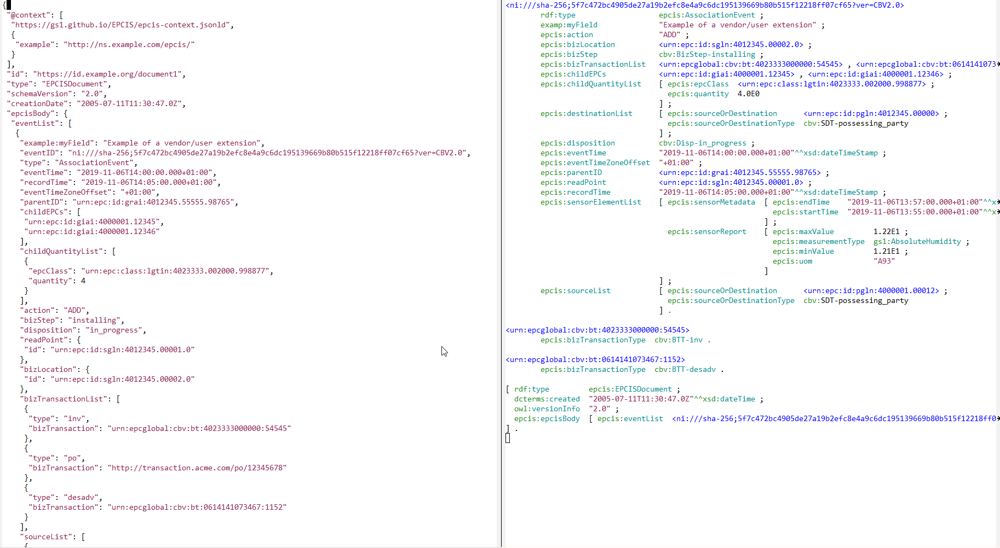
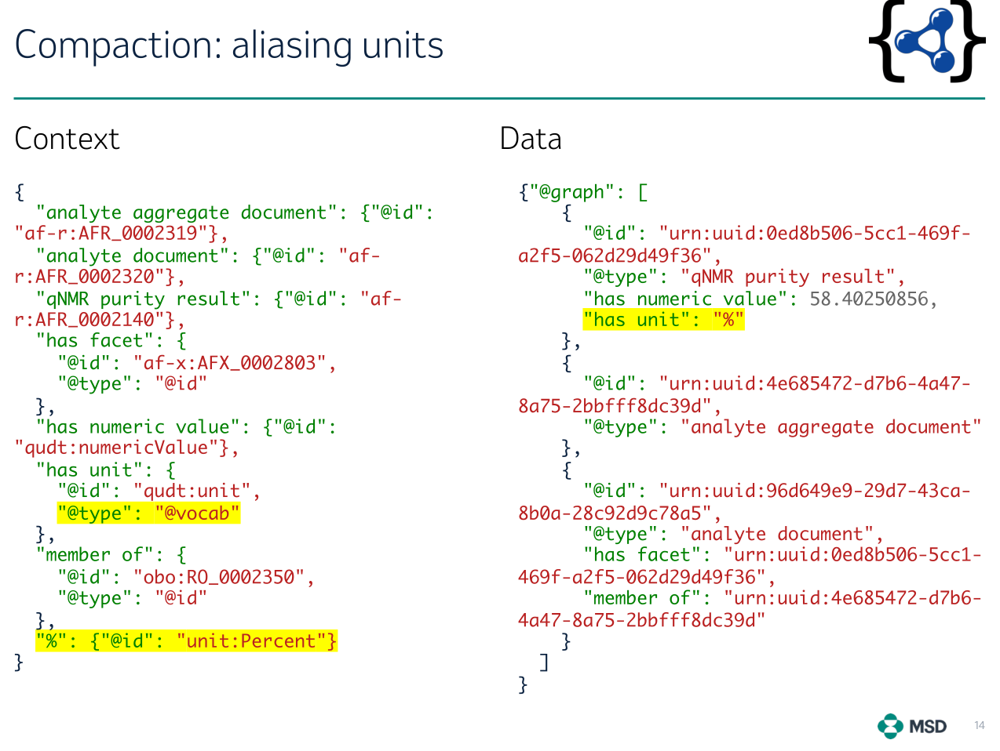
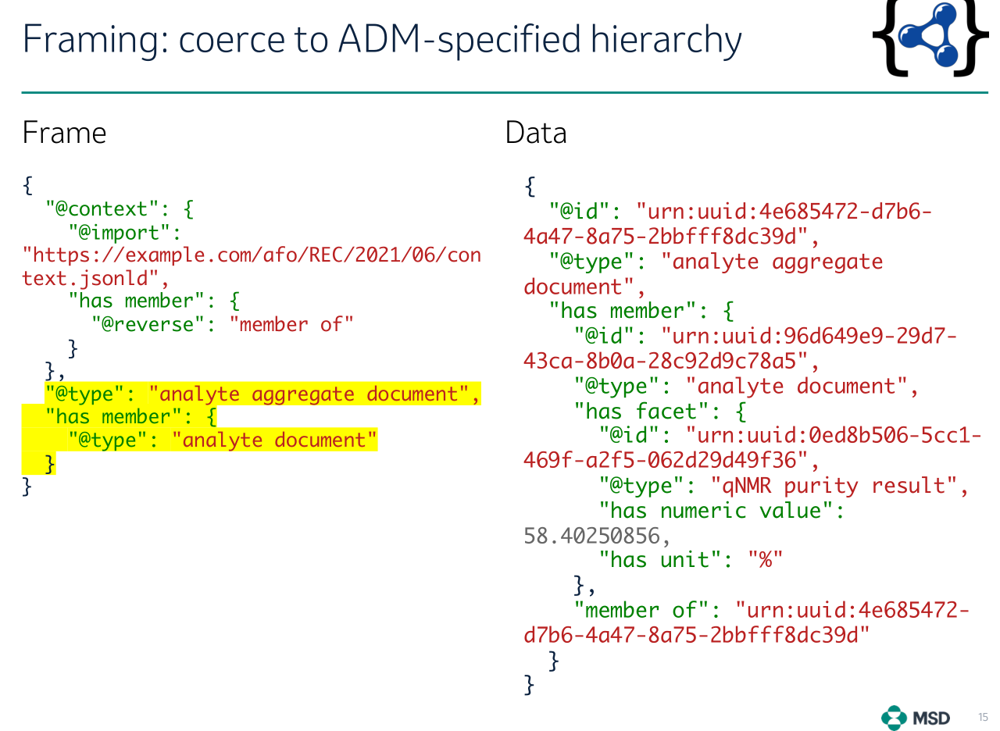
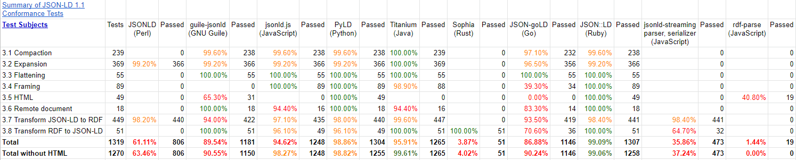

# JSON-LD

- Came from the desire to let devs use RDF data in an easier way
  - Manu Sporny has called RDF the "Three Mile Island nuclear disaster" of the semantic web
- JSON-LD started 2010, now is a mature set of specs and implementations
- Includes 

Links:

- Site: <https://json-ld.org/>, including publicaitons and specs
- Playground: <https://json-ld.org/playground/>, based on `jsonld-js`, often used for testing

## JSON-LD Specs

Links are to latest editor drafts:

- [JSON-LD Syntax](https://w3c.github.io/json-ld-syntax/): The core spec
- [JSON-LD Algorithms and API](https://w3c.github.io/json-ld-api/): expansion, compaction, flattening; serialization, parsing (deserialization)
- [JSON-LD Framing](https://w3c.github.io/json-ld-framing/): Framing is the 4th fundamental algorithm: which RDF data to use, what objects to embed vs to reference
- [JSON-LD Best Practices](https://w3c.github.io/json-ld-bp/): Draft
- [JSON-LD Streaming](https://w3c.github.io/json-ld-streaming/): How to chunk/stream JSON; NDJSON is just one way, another is based on particular element order
- [RDF Dataset Canonicalization](https://w3c-ccg.github.io/rdf-dataset-canonicalization/spec/): Important in crypto-signing use cases.
  - Difficult because blank nodes require solving the "graph isomorphism" problem
- [JSON-LD-Star](https://json-ld.github.io/json-ld-star/): How to capture RDF-star, draft
- [JSON-LD CBOR](https://w3c.github.io/json-ld-cbor/): CBOR is a binary representation for JSON
- [YAML-LD](https://json-ld.github.io/yaml-ld/): YAML is a better JSON. CG started by me, see end

## What JSON-LD Can Do

Map JSON to RDF and back in flexible ways:

- [Interpret any JSON as RDF](https://w3c.github.io/json-ld-syntax/#modifying-behavior-with-link-relationships) by using an external Context (`Link` header)
- Map JSON objects to RDF nodes: URL is field `@id`, or blank if none
- Express node types: `rdf:type` is field `@type`, can be array
- Map JSON fields to RDF props: attributes (data props) and relations (object props)
- Map some strings to individuals by using `@base`
- Attach datatypes to literals
- Attach lang tags to strings
- Treat JSON arrays as multivalued props (`@set`, default) or `rdf:List` (`@list`)
- `@nest` extra fixed JSON props on RDF serialization, or omit JSON props on parsing
- Interpret JSON props locally, based on prop path or node type (nested contexts)
- Produce and parse RDF graphs
- Group data by subject, lang tag, etc (`@container`)
- Alias keywords, eg `"url": "@id", "a": "@type", "lang": "@language"`

## What JSON-LD Cannot Do

- Clean up or reformat data
- Change fundamentally the layout of data
- Validate data (use JSON Schema, SHACL or SHEX for that)
- Concatenate fields to make a URL
- Make RDF sub-nodes

So what to do if a more complex transformation is needed?

- Use a "basic" JSON-LD context to map literals and URLs (if present)
- Convert to RDF and load it to a "staging" graph/repo
- Use SPARQL Update to reshape the data to a final graph/repo

## How GraphDB Uses JSON-LD

- As data loading format and RDF output format (whole graph/repo, resource, CONSTRUCT)
- In [Mongo Connector](https://graphdb.ontotext.com/documentation/10.0/mongodb-graphdb-connector.html): fetch JSON from Mongo, use it as RDF in SPARQL
  - With embedded context (duplication) or URL (network) context
  - But cannot use externally provided context
- Limited to JSON 1.0 (see later)

## Example from GS1 EPCIS (JSON vs Turtle)



## Context Examples from GS1 EPCIS

See [epcis-context.jsonld](https://github.com/gs1/EPCIS/blob/master/epcis-context.jsonld) or my [epcis-context-simple.jsonld](https://github.com/gs1/EPCIS/blob/master/epcis-context-simple.jsonld).

Field `type` means different RDF props depending on context:

- In `sourceList` it's `epcis:sourceOrDestinationType` (eg `cbv:SDT-possessing_party`)
- In `bizTransactionList` it's `epcis:bizTransactionList` (eg `cbv:BTT-bol`)
- In `sensorReport` it's `epcis:measurementType` (eg `gs1:AbsoluteHumidity`)

```js
  "@context": {
    "type": "@type",
    "sourceList": {
      "@id": "epcis:sourceList",
      "@context": [
          "possessing_party": "cbv:SDT-possessing_party", ...
          "type": {
            "@id": "epcis:sourceOrDestinationType",
    "bizTransactionList": {
      "@id": "epcis:bizTransactionList",
      "@context": [
          "bol": "cbv:BTT-bol", ...
          "type": {
            "@id": "epcis:bizTransactionType",
    "sensorElementList": {
      "@id": "epcis:sensorElementList",
        "sensorReport": {
          "@id": "epcis:sensorReport",
          "@context": {
            "type": {
              "@context": {
                "AbsoluteHumidity": "gs1:AbsoluteHumidity", ...
              "@id": "epcis:measurementType",
```

Can you spot a bug above?

## Allotrope Foundation

- Defines bridging between RDF and HDT5 (binary format for research & engineering data)
- Widely used in Lab Measurements community
- Hope to use for Architectural data in ACCORD
- Simplified JSON-LD representations of linked data based on Allotrope Data Models,
  Jindřich Mynarz, Jan Rosecký, Vincent Antonucci, Jan Nešpor
  Merck R&D IT Data Infrastructure.
  Presentation at Allotrope Connect, 20 September 2021:
  [video](https://youtu.be/irZ0i2fA47E), [slides](https://www.allotrope.org/_files/ugd/d6fa33_215d90dde49540bb9d58339731be7a95.pdf)

## Context Examples from Allotrope



## Frame Examples from Allotrope



# Importance of Precise JSON-LD Serializations

- Many communities base their data exchange on JSON Schema
- Yet want to have LD representation of their data

Examples:

- [Decentralized Identifiers](https://www.w3.org/TR/did-core/)
- [Verifiable Credentials](https://www.w3.org/TR/vc-data-model/)
- [Data Integrity](https://www.w3.org/community/reports/credentials/CG-FINAL-data-integrity-20220722/)
- [JSON Web Signature 2020](https://w3id.org/security/suites/jws-2020)
- [UNCEFACT Buy Ship Pay Reference Data Model](https://service.unece.org/trade/uncefact/vocabulary/uncefact/)
- [Traceability](https://w3c-ccg.github.io/traceability-vocab/) in trade and logistics
- [Insurance Acord model](https://www.acord.org/)
- International Image Interoperability Framework ([IIIF](https://iiif.io/)): [Image](https://iiif.io/api/image) and [Presentation](https://iiif.io/api/presentation) APIs (eg for Flemish Archive)

## Example Use Cases

Eg <https://jsld.org>: use cases building on JSON-LD by [transmute.industries](https://www.transmute.industries/)

- Decentralized Identifiers
- Verificable Credentials
- Encrypted Data Vaults
- Agriculture Futures
- Incident Response

# Innovations in JSON-LD 1.1

Compared to JSON-LD 1.0, 1.1 has many advanced features:

- [Scoped (Nested) Contexts](https://w3c.github.io/json-ld-syntax/#scoped-contexts): localize prop definitions to prop path and/or type
- [Included Nodes/Blocks](https://w3c.github.io/json-ld-syntax/#included-nodes): include secondary node objects in the current node
- [Nested Property](https://w3c.github.io/json-ld-syntax/#nested-properties): add extraneous JSON prop levels not reflected in JSON
- [Reverse Properties](https://w3c.github.io/json-ld-syntax/#reverse-properties): JSON field is mapped to the inverse of an RDF prop
- [Indexing](https://w3c.github.io/json-ld-syntax/#data-indexing) of JSON by data, id, lang, graph, etc
- [Framing](https://w3c.github.io/json-ld-framing/): express which RDF data to pick and how to lay it out

... too numerous to list all.

## JSON-LD Conformance Tests

Best feature of W3C specs: accompanied by Implementation Reports

- [JSON-LD 1.1 Processor Conformance](https://w3c.github.io/json-ld-api/reports/)
- Generated from EARL results from the JSON-LD 1.1 Test Suite
- EARL is an ontology to capture rest results
- Test subjects:
  - JSONLD (Perl)
  - guile-jsonld (GNU Guile)
  - jsonld.js (JavaScript)
  - PyLD (Python)
  - Titanium (**Java**)
  - Sophia (Rust)
  - JSON-goLD (Go)
  - JSON::LD (Ruby)
  - jsonld-streaming-parser & serializer (JavaScript)
  - rdf-parse (JavaScript)
- Task [KGS-70](https://ontotext.atlassian.net/browse/KGS-70), [earl-report#6](https://github.com/gkellogg/earl-report/issues/6) to add a summary table at end
  - Please volunteer! Need to learn a bit of HAML (HTML abstraction markup language)

## JSON-LD Conformance Results



## JSON-LD Support in RDF4J & GDB

- RDF4J supports only JSON-LD 1.0 through `jsonld-java` ([rdf4j#3654](https://github.com/eclipse/rdf4j/issues/3654))
  - Need to add [Titanium JSON-LD](https://github.com/filip26/titanium-json-ld/) for JSON-LD 1.1 support
  - Titanium performance improved 2x from 03.12.2020 to 02.04.2022
  - But is still 4.6x slower than  `jsonld-java`
  - So need to keep both libraries, and select based on request header or other options
  - Tracked as [GDB-7322](https://ontotext.atlassian.net/browse/GDB-7322) 1.1 support; [GDB-7324](https://ontotext.atlassian.net/browse/GDB-7324) conformance testing
- RDF4J can specify context for serialization, but doesn't expose it through request header
  - Which context and frame to use: asked [w3c/json-ld-framing#133](https://github.com/w3c/json-ld-framing/issues/133)
- Jena has integrated Titanium ([JENA-1948](https://issues.apache.org/jira/browse/JENA-1948)): reading is done, writing is in progress ([JENA-2153](https://issues.apache.org/jira/browse/JENA-2153))

# New Community Group: YAML-LD

- JSON is nice: devs love it
  - It's easy to use in apps
- But YAML is nicer: both devs and data archtects love it
  - As easy to process as JSON
  - Much easier to read than JSON: goes away with the curlies and most of the quotes
- Yet, YAML is a superset of JSON as it can:
  - Have anchors and references -> reuse YAML pieces
  - Use object as key (fields not limited to strings) -> RDF-star
  - Declare tags eg `!xsd!date 2022-10-28` ->  datatypes
  - Have multiple docs in a file (stream) -> multiple named graphs in a file

So I started thinking about YAML-LD: [w3c/json-ld-syntax#389](https://github.com/w3c/json-ld-syntax/issues/389)

## YAML-LD Community Group

- Initiated by Vladimir Alexiev
- Constituted by Gregg Kellogg as part of the JSON-LD WG
- Github: <https://github.com/json-ld/yaml-ld/>
- [Issues](https://github.com/json-ld/yaml-ld/issues): 49.
  - I made 16 and contributed to maybe 20 more
  - [yaml-ld#2](https://github.com/json-ld/yaml-ld/issues/2): Use Case Requirements, recorded 14 UCRs
- [YAML-LD spec](https://json-ld.github.io/yaml-ld/spec/) (very draft)

## YAML-LD Examples

- Use tags for datatypes
```yaml
 dc:date: !xsd!date 2022-05-18  # short form

 dc:date:                       # subfields (long form)
   @type: xsd:date
   @value: 2022-05-18
``` 

- Use `$` instead of `@`: more dev-friendly

```yaml
  "@context":
    "@sigil": $
    $base: http://example.org/resource/
    $vocab: http://example.org/ontology/
  $graph:
    $id: bart
    spouse: marge
```

- Object keys for RDF-star

```yaml
  {$id: bob, age: 42}: {certainty: 0.8} # very natural!

  $id: bob
  age: 
    $value: 42
    $annotation:                        # new keyword (long form)
      certainty: 0.8
```

# Polyglot Modeling

[yaml-ld#19](https://github.com/json-ld/yaml-ld/issues/19)

- WHO: As an information architect
- WHAT: I want data modeling language(s) independent of technical artefacts
- SO THAT:
  - the language is understandable to domain experts
  - it can generate a variety of required technical artefacts
  - all these artefacts are kept in sync, thus lowering maintenance effort

## Multiple Schema Technical Artefacts

For efficient RDF modeling, you need to define multiple related artefacts:

- ontology
- shapes (SHACL or SHEX)
- diagrams and other documentation
- JSON-LD context,
- maybe JSON-LD frames,
- JSON schema or Avro schema
- API bindings and hypertext controls (HATEOAS)
- etc

## JSON Schema vs JSON-LD Context

Efforts to marry JSON Schema with JSON-LD contexts have been undertaken in:

- [W3C Credentials CG](https://w3c-ccg.github.io/)
- Web of Things: [WoT JSON Schema](https://www.w3.org/2019/wot/json-schema), [Hypermedia](http://www.w3.org/2019/wot/hypermedia) vocabulary
- OpenAPI: [OpenAPI-Specification](https://github.com/OAI/OpenAPI-Specification/), [OAS Semantic Context](https://docs.google.com/document/d/1fBRH2wtg1p_g4voNSTlHiSJmKgvfNaIsUXwPBO36RuM/edit), in particular for eGovernment APIs

## Examples of Polyglot Frameworks

Many are YAML-based:

- [LinkML](https://linkml.io/) ([github](https://github.com/linkml))
- [HL7 FHIR](https://www.hl7.org/fhir/) (not YAML-based)
- [ShExC](http://shex.io/shex-semantics/index.html#shexc)/[ShExJ](http://shex.io/shex-semantics/index.html#shexj)/[ShExR](https://www.w3.org/ns/shex.jsonld), now YAML (ShExY?)
- [Schema Salad](https://www.commonwl.org/v1.2/SchemaSalad.html) 
- [A.ML](https://a.ml/) and [cloudinformationmodel](https://github.com/cloudinformationmodel/cloudinformationmodel) 
- [RAML](http://raml.org/) (RESTful API Modeling Language), [RAML spec](https://github.com/raml-org/raml-spec)
- Dragon at Uber, eg [Dragon: Schema Integration at Uber Scale](https://eng.uber.com/dragon-schema-integration-at-uber-scale/) ([cached PDF](https://1fykyq3mdn5r21tpna3wkdyi-wpengine.netdna-ssl.com/wp-content/uploads/2020/03/Schema-Integration-at-Uber-Scale-US2TS-2020-1.pdf)).
  - YAML schema examples start slide 42
- [SOML](https://platform.ontotext.com/3.0/soml/index.html) for Semantic Objects, Semantic Search (Ontotext)
  - Maybe Ontotext Reconciliation servers can be built on this?
- [smart-data-models](https://smartdatamodels.org/) (FIWARE, IUDX, SmartCities, TM forum).
  - Example: [Aircraft](https://github.com/smart-data-models/dataModel.Aeronautics/tree/master/Aircraft). [contribution manual gslides](https://docs.google.com/presentation/d/e/2PACX-1vTs-Ng5dIAwkg91oTTUdt8ua7woBXhPnwavZ0FxgR8BsAI_Ek3C5q97Nd94HS8KhP-r_quD4H0fgyt3/pub?start=false&loop=false&delayms=3000&slide=id.p1)

# Links

- [My publications](https://vladimiralexiev.github.io/my/index.html)
- This presentation: [JSON-LD and Polyglot Modeling](https://vladimiralexiev.github.io/my/pres/20221028-JSONLD/Slides.html)
- [Decentralization and Self-Sovereignty](https://docs.google.com/presentation/d/1AEwLjM7ry6BeM0XoF8EVbl5zeoMkE-tBht0CcL3cfPk/edit): presentation and [gdoc](https://docs.google.com/document/d/1qpMAa55SYV6E4D_ffIgsZopmpzrUrjjR9c36SXXCVZQ/edit)

