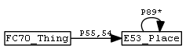
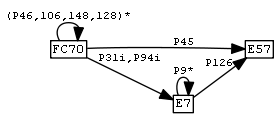

# British Museum CIDOC CRM Fundamental Relations Implementation

# Introduction
This file was migrated from [ResearchSpace/FR Implementation](https://confluence.ontotext.com/display/ResearchSpace/FR+Implementation), which is a retired confluence.
Some of the links below are broken (they look like \[Broken Link\]).
- The source (which used to be in [svn/researchspace/search/FR-Implementation.txt](https://svn.ontotext.com/svn/researchspace/trunk/search/FR-Implementation.txt)) was used to generate GraphDB rules.
- Work on this page started in Feb 2013 and was completed in Dec 2013
- CRM Fundamental Relations are defined in: Katerina Tzompanaki, Martin Doerr: A New Framework for Querying Semantic Networks. FORTH technical report TR419, May 2011.
  They are used to make a search layer over a rich CRM network
- This is the first implementation of CRM Fundamental Relations, see
  - Vladimir Alexiev: Implementing CIDOC CRM Search Based on Fundamental Relations and OWLIM Rules.
    Workshop on Semantic Digital Archives (SDA 2012), part of International Conference on Theory and Practice of Digital Libraries (TPDL 2012).
    CEUR-WS vol 912. [paper](http://ceur-ws.org/Vol-912/paper8.pdf), [presentation](http://rawgit2.com/VladimirAlexiev/my/master/pubs/Alexiev2012-CRM-Search-presentation.pdf)
  - Vladimir Alexiev, Dimitar Manov, Jana Parvanova, Svetoslav Petrov: Large-scale Reasoning with a Complex Cultural Heritage Ontology (CIDOC CRM).
    Workshop Practical Experiences with CIDOC CRM and its Extensions (CRMEX 2013) at TPDL 2013.
    CEUR-WS vol 1117. [paper](http://ceur-ws.org/Vol-1117/paper8.pdf), [presentation](http://rawgit2.com/VladimirAlexiev/my/master/pubs/Alexiev2013-CRM-reasoning-slides.ppt)

## OWLIM Rules and Reasoning Dialect

RS3.1 FRs were implemented using reasoning dialect "OWL RL (optimized)", i.e. `builtin_owl2-rl.pie`.
We used constructs `owl:PropertyChainAxiom, owl:TransitiveProperty, owl:ReflexiveProperty`, and` rdfs:subPropertyOf` (which amounts to disjunction).
But as described in \[OWLIM Rules vs OWL RL#Less Expressive\], OWL RL is less expressive than OWLIM Rules, since one cannot define a property by conjunction.
We are pretty sure the full FR set will require conjunction, so we'll go with OWLIM Rules. See [GraphDB Rules documentation](https://graphdb.ontotext.com/documentation/10.5/reasoning.html#reasoning-rules).

We'll use the RDFS reasoning dialect as a basis, by weaving our rules into `builtin_RdfsRules.pie`. That file is part of the OWLIM distribution, in my case
`c:\my\Onto\proj\OWLIM\software\owlim-se-4.2.3924\builtin_RdfsRules.pie`

## Weaving for Production

This page is used to generate OWLIM artefacts for production. We "weave" them from code blocks in the page, following [Literate Programming](http://en.wikipedia.org/wiki/Literate_Programming). We weave several files based on code block titles:

| Title    | Weaved into                                                                           |
|----------|---------------------------------------------------------------------------------------|
| Turtle   | (x) (not yet implemented) FR.ttl, The old file RF.ttl will be deleted from svn       |
| Prefices | builtin_RdfsRules.pie, at the beginning of section Prefices (after the opening brace) |
| Axioms   | builtin_RdfsRules.pie, at the beginning of section Axioms (after the opening brace)   |
| Rule     | builtin_RdfsRules.pie, at end of file (before the closing brace)                      |
| Rules    | same place, but these are shorthand rules (see below)                                 |

- the weaver automatically generates rule identifiers in the form `Id: fr$n` where `$n` is a counter
- "Rule" includes one rule per code block in the OWLIM notation, eg:
```pie
premise1 [Constraint ...]
premise2 [Cut]
-------------------
corollary1
corollary2
```
- "Rules" includes one rule per line in a shorthand notation, eg:
```pie
premise1 [Constraint ...]; premise2 [Cut] => corollary1; corollary2
```

The shortcut notation is translated to the OWLIM notation. This shortcut form is very useful for shorter rules.

## Rule Validation

In addition to weaving FR-implementation.pie, the script performs rule validation: for each rule, checks that variables are used in a "linear" fashion, eg

```pie
x <rdf:type> <rso:FC70_Thing>; x <crm:prop1> y; y <rso:subFR> z => x <rso:FR> z
```

Variables on the LHS should form a chain, with possible type-check branches.
The RHS should use the first and last var in the same order

## Modularity and Naming

A very important aspect of our implementation is modularity: we define appropriate sub-FRs and use them when defining FRs.
We use the Erlangen CRM (ECRM) naming variant (underscores instead of dots), and the following naming conventions:

- `crm:Enn_entity_name, crm:Pnn_property_name`: CRM entities and properties
- `rso:FRnn_name`: property representing an FR
  - rso stands for "RS ontology"
  - `nn` is a number that we try to keep the same as a related CRM property number (eg `FR7_thing_from_place` is numbered after `P7_took_place_at`)
- `rso:FRXnn_name`: property representing a sub-FR
  - if the sub-FR is a disjunction of several CRM properties, we mention all numbers:
    `FRX_62_67 := P62_depicts or P67_refers_to`
- `rso:FRTnn_name`: transitive closure of `crm:Pnn_name`
  - we denote this as `FRTnn_name := Pnn_name+`
- `rso:FRSTnn_name`: symmetric-transitive closure of `crm:Pnn_name`
  - we denote this as `FRSTnn_name := (Pnn_name or Pnni_inverse_name)+`
- `rso:FCnn_name`: Fundamental Concept or another class used in defining FRs

## FR Dependency Graph

`FR-weave.pl` generates a dependency graph (processed with graphviz dot) showing which CRM props and sub-FRs are used in the implementation of each FR. Legend:
- plain text: 51 source classes/properties
- filled rectangles: 13 intermediate sub-FRs
- rectangles: 19 target FRs

This lets you see which CRM properties are "bundled" into which FRs.
- It was an indispensable debugging aid while creating th FRs (that there are no disconnected properties, each FR uses all source properties as expected, etc).
- Similar info about the old implementation is at \[FR Implementation-old#FR Summary (Short Variant)\] or \[FR Implementation-old#FR Summary (Long Variant)\]

<a href="FR-graph.png" class="attachment">FR-graph.png</a> (full resolution)


## Prefixes

This would add prefixes to `FR.ttl` (but we don't use such file):

```pie
@prefix crm  : <http://erlangen-crm.org/current/> .
@prefix owl  : <http://www.w3.org/2002/07/owl#> .
@prefix rdf  : <http://www.w3.org/1999/02/22-rdf-syntax-ns#> .
@prefix rdfs : <http://www.w3.org/2000/01/rdf-schema#> .
@prefix rso  : <http://www.researchspace.org/ontology/> .
```

This adds prefixes to the rules file (it already has: `rdf rdfs owl xsd`):

```pie
 crm : http://erlangen-crm.org/current/
 ptop: http://www.ontotext.com/proton/protontop#
 bmo : http://collection.britishmuseum.org/id/ontology/
 rso : http://www.researchspace.org/ontology/
```

## Transitive Properties

### TransitiveProperty

`owl:TransitiveProperty` is a well-known OWL type stating that a property is transitive. ECRM declares the appropriate CRM properties as transitive, but for some reason it doesn't declare `P9,P46` transitive (other "part of" properties, eg `P106,P148` are transitive). I posted a bug to CRM SIG and fix it here:

```pie
<crm:P9_consists_of> <rdf:type> <owl:TransitiveProperty>
<crm:P9i_forms_part_of> <rdf:type> <owl:TransitiveProperty>
<crm:P46_is_composed_of> <rdf:type> <owl:TransitiveProperty>
<crm:P46i_forms_part_of> <rdf:type> <owl:TransitiveProperty>
```

The full list of transitive properties is:
- `P9_consists_of, P9i_forms_part_of` (ADDED)
- `P10_falls_within, P10i_contains`
- `P46_is_composed_of, P46i_forms_part_of` (ADDED)
- `P86_falls_within, P86i_contains`
- `P88_consists_of, P88i_forms_part_of`
- `P89_falls_within, P89i_contains`
- `P106_is_composed_of, P106i_forms_part_of`
- `P114_is_equal_in_time_to`
- `P115_finishes, P115i_is_finished_by`
- `P116_starts, P116i_is_started_by`
- `P117_occurs_during, P117i_includes`
- `P120_occurs_before, P120i_occurs_after`
- `P127_has_broader_term, P127i_has_narrower_term`
- `P148_has_component, P148i_is_component_of`

Note: we used to use owl:TransitiveProperty to make the transitive closure for some sub-FRs. But now we prefer to do it with explicit rules, since we want to always start at `FC70_Thing`, so as to eliminate useless triples

### transitiveOver

`ptop:transitiveOver` is a useful generalization defined by the [Proton Ontology](http://www.ontotext.com/proton-ontology). The semantics is defined with the following axiom:

```pie
(p,transitiveOver,q) (x,p,y) (y,q,z) => (x,p,z)
```

Sample usage is:

```pie
(locatedIn, transitiveOver, subRegionOf) (Ontotext,locatedIn,Bulgaria) (Bulgaria,subRegionOf,Europe) => (Ontotext,locatedIn,Europe)
```

We use this in `FR-Transitive.ttl` (described in \[FR Transitivity\]) to state that certain FRs are transitive over skos:broader.

We use the RDFS reasoning dialect as a basis, which implements `rdfs:subClassOf` and `rdfs:subPropertyOf` reasoning. To this we add relevant rules from `builtin_owl2-rl.pie`:

```pie
p <ptop:transitiveOver> q; x p y; y q z => x p z
p <rdf:type> <owl:TransitiveProperty>; x p y; y p z => x p z
```

TODO: `ptop:transitiveOver` is more efficient than `owl:TransitiveProperty` since it uses only the step relation (eg `skos:broader`) but not its transitive closure (eg `skos:broaderTransitive`). Unfortunately CRM doesn't define step relations for its transitive properties.

## Inverse Properties

Most CRM properties have an inverse, eg `P110i_was_augmented_by` is inverse of `P110_augmented` (Symmetric properties are their own inverse). ECRM declares all inverse properties as `owl:inverseOf`. Inverse reasoning is useful since it frees you from dependencies on how exactly the data is asserted:

```pie
p <owl:inverseOf> q; x p y => y q x
p <owl:inverseOf> q; x q y => y p x
```

## Symmetric Properties

ECRM declares all CRM symmetric properties as owl:SymmetricProperty. ECRM always declares them as owl:inverseOf itself, so we don't need to treat them separately. Eg:

```pie
crm:P122_borders_with rdf:type owl:SymmetricProperty.
crm:P122_borders_with owl:inverseOf crm:P122_borders_with.
```

The full list of symmetric properties is:

- `P69_is_associated_with`
- `P114_is_equal_in_time_to`
- `P121_overlaps_with`
- `P122_borders_with`
- `P132_overlaps_with`
- `P133_is_separated_from`

## No Reflexive Closure

FR definitions are full of reflexive-transitive sub-FRs. In `FRThing.docx` they are denoted `(Pnnn)(0,n)`, and below we denote them as `Pnn*`. Eg
- `x from z := x P74 y AND y P89* z`

But it's bad style to use reflexive closure in the implementation since it generates lots of trivial facts (self-loops) in the semantic repository. Instead of reflexive closure, we use disjunction: the iterated property is applied 0 times in the first disjunct, and n times in the second, eg:
- `x from z := x P74 z OR (x P74 y AND y P89+ z)`

## FR Notes

FR design in the following sections is based on `FRThing.docx` by M.Doerr and K.Tzompanaki, after clarifications and corrections by V.Alexiev.

- We don't implement FRs:
  - for which there is no data in neither Rembrandt nor BM collections
  - that are interesting for history/archaeology but not museum collections (eg Destroyed at)
  - that use the CRM Digital (CRMdig) extensions
- We omit composite FR such as "Was created/produced by person from" since they are treated separately
- In many cases we don't check types, since these are implied by the domain/range of a property. Eg in:
  - `E24_Physical_Man-Made_Thing - P128_carries -> E73_Information_Object`
    the property `P128` implies that the source and target have the indicated types
- We check types (`FC70_Thing`) as early as possible to eliminate useless inferences
- We define FRs and sub-FRs using [SPARQL Property Paths](http://www.w3.org/TR/sparql11-property-paths/#path-language)

# Fundamental Concepts

## Thing

### `FC70_Thing` in General

"Thing" is defined as the following (was called `C1.Object`):
- `FC70_Thing := E70_Thing NOT E21_Person NOT E55_Type NOT E30_Right NOT E41_Appellation`

The concept of "NOT subclass" is not expressible with OWLIM rules:
- OWLIM rules can check `!= class`, but not subclasses
- `owl:complementOf` and `owl:disjointWith` are used only for consistency checking (to infer a contradiction), not to define classes

I tried enumerating negative classes:
```pie
x <rdf:type> t [Constraint t!=<crm:E21_Person>, t!=<crm:E55_Type>, t!=<crm:E30_Right>, t!=<crm:E41_Appellation>]
t <rdfs:subClassOf> <crm:E70_Thing>
--------------------
x <rdf:type> <rso:FC70_Thing>
```

But that doesn't work (even if I enumerate all negative subclasses), since an `E21_Person` (negative) is also an `E19_Physical_Object` (positive), and we want `E19`.
Enumerating positive classes doesn't work either, for the same reason.

So FC70 would need to be implemented in SPARQL, eg

```sparql
?x rdf:type crm:E70_Thing.
NOT (?x rdf:type crm:E21_Person, etc)
```

### `FC70_Thing` and `FR_dataset` for RS

In RS we compute a dataset, which is important to select the right RForm; and to display a Dataset facet in the RS search. We now have 3 datasets (RKD, BM, YCBA):
- RKD data includes sub-objects (eg related/n is a related work, part/n is a frame that is part of a painting) that we can't display, so we introduced an extension sub-class `rso:E22_Museum_Object`. Because Rembrandt paintings come from different places, RKD data has varying keepers/owners: Mauritshuis, Rijksmuseum, Metropolitan, NGA.
- BM data uses `crm:E22_Man-Made_Object`. One of the current keepers is always the BM. The current owner may be missing (see \[BM Association Mapping Problems#Poor Acquisition\]), so we need to check both `P52` and `P50`
- YCBA data uses `crm:E22_Man-Made_Object`, and the keeper/owner is YCBA.

The BM has two sameAs URIs:
- <http://collection.britishmuseum.org/id/the-british-museum>
- <http://collection.britishmuseum.org/id/person-institution/104636>

So to avoid duplicate results, we define the dataset as a literal.
Then `FC70_Thing` is defined as something with a dataset.

```pie
x <rdf:type> <rso:E22_Museum_Object> => x <rso:FR_dataset> "RKD"
x <rdf:type> <crm:E22_Man-Made_Object>; x <crm:P50_has_current_keeper> <http://collection.britishmuseum.org/id/the-british-museum> => x <rso:FR_dataset> "BM"
x <rdf:type> <crm:E22_Man-Made_Object>; x <crm:P52_has_current_owner>  <http://collection.britishmuseum.org/id/the-british-museum> => x <rso:FR_dataset> "BM"
x <rdf:type> <crm:E22_Man-Made_Object>; x <crm:P50_has_current_keeper> <http://vocab.getty.edu/ulan/500303557>    => x <rso:FR_dataset> "YCBA"
x <rdf:type> <crm:E22_Man-Made_Object>; x <crm:P52_has_current_owner>  <http://vocab.getty.edu/ulan/500303557>    => x <rso:FR_dataset> "YCBA"
x <rso:FR_dataset> y => x <rdf:type> <rso:FC70_Thing>
```

Note: the Yale URI changed to a true ULAN URI, see \[Yale Mapping Problems#Getty URIs\]

# Fundamental Relations

## Sub-FRs

Here we define some auxiliary (sub) FRs that are used below.
We are careful to root all of them on FC70_Thing in order not to generate useless triples

- `FRT_46_106_148 := (P46_is_composed_of | P106_is_composed_of | P148_has_component)+`

```pie
x <rdf:type> <rso:FC70_Thing>; x <crm:P46_is_composed_of>  y => x <rso:FRT_46_106_148> y
x <rdf:type> <rso:FC70_Thing>; x <crm:P106_is_composed_of> y => x <rso:FRT_46_106_148> y
x <rdf:type> <rso:FC70_Thing>; x <crm:P148_has_component>  y => x <rso:FRT_46_106_148> y
x <rso:FRT_46_106_148> y; y <crm:P46_is_composed_of>  z => x <rso:FRT_46_106_148> z
x <rso:FRT_46_106_148> y; y <crm:P106_is_composed_of> z => x <rso:FRT_46_106_148> z
x <rso:FRT_46_106_148> y; y <crm:P148_has_component>  z => x <rso:FRT_46_106_148> z
```

- `FRT_46_106_148_128 := FRT_46_106_148 | P128_carries+`

```pie
x <rso:FRT_46_106_148> y => x <rso:FRT_46_106_148_128> y
x <rso:FRT_46_106_148_128> y;  y <rso:FRT_46_106_148> z => x <rso:FRT_46_106_148_128> z
x <rdf:type> <rso:FC70_Thing>; x <crm:P128_carries> z => x <rso:FRT_46_106_148_128> z
x <rso:FRT_46_106_148_128> y;  y <crm:P128_carries> z => x <rso:FRT_46_106_148_128> z
```

- `FRT_46_106_148_128_130 := FRT_46_106_148_128 | (P130_shows_features_of | P130i_features_are_also_found_on)+`

```pie
x <rso:FRT_46_106_148_128> y => x <rso:FRT_46_106_148_128_130> y
x <rso:FRT_46_106_148_128_130> y; y <rso:FRT_46_106_148_128> z => x <rso:FRT_46_106_148_128_130> z
x <rdf:type> <rso:FC70_Thing>;    x <crm:P130_shows_features_of>           y => x <rso:FRT_46_106_148_128_130> y
x <rdf:type> <rso:FC70_Thing>;    x <crm:P130i_features_are_also_found_on> y => x <rso:FRT_46_106_148_128_130> y
x <rso:FRT_46_106_148_128_130> y; y <crm:P130_shows_features_of>           z => x <rso:FRT_46_106_148_128_130> z
x <rso:FRT_46_106_148_128_130> y; y <crm:P130i_features_are_also_found_on> z => x <rso:FRT_46_106_148_128_130> z
```

- `FRT107i_member_of := P107i_is_current_or_former_member_of+`

```pie
x <crm:P107i_is_current_or_former_member_of> y                              => x <rso:FRT107i_member_of> y
x <crm:P107i_is_current_or_former_member_of> y; y <rso:FRT107i_member_of> z => x <rso:FRT107i_member_of> z
```

- `FRT9_10 := (P9_consists_of | P10_falls_within)+`

```pie
x <crm:P9_consists_of> y => x <rso:FRT9_10> y
x <crm:P10_falls_within>  y => x <rso:FRT9_10> y
x <rso:FRT9_10> y; y <crm:P9_consists_of> z => x <rso:FRT9_10> z
x <rso:FRT9_10> y; y <crm:P10_falls_within>  z => x <rso:FRT9_10> z
```

- `FRX24i_30i := (FC70_Thing) (P24i_changed_ownership_through | P30i_custody_transferred_through)`

```pie
x <rdf:type> <rso:FC70_Thing>; x <crm:P24i_changed_ownership_through>   y => x <rso:FRX24i_30i> y
x <rdf:type> <rso:FC70_Thing>; x <crm:P30i_custody_transferred_through> y => x <rso:FRX24i_30i> y
```

- `FRX24i_25i_30i := (FC70_Thing) (FRX24i_30i | P25i_moved_by) / P9_consists_of*`

```pie
x <rso:FRX24i_30i> y => x <rso:FRX24i_25i_30i> y
x <rdf:type> <rso:FC70_Thing>; x <crm:P25i_moved_by> y => x <rso:FRX24i_25i_30i> y
x <rso:FRX24i_25i_30i> y; y <crm:P9_consists_of> z => x <rso:FRX24i_25i_30i> z
```

## Thing-Place

### Thing about Place: `FR67_about_place`

Thing depicts or refers to a place or feature located in place, or is similar in features or composed of or carries an information object that depicts or refers to a place

As defined in FRThing.docx:


Corrected definition:


Fixes:

1.  At beginning: does not allow paths of mixed properties (eg `P130-P130i, P106-P148`), or with `P46,P106,P148` preceding `P130,P130i`
    - Resolved: we mix all these properties freely: any path of the indicated properties, in any order, of any length
2.  At `E73_Information_Object`: does not allow `P106_is_composed_of, P148_has_component` which are legitimate for `E7`3 (being a subclass of both `E89_Propositional_Object` and `E90_Symbolic_Object`)
    - Resolved: we add P128 into the mix.
      Did we mix it up too much? I think it's ok: not all allowed paths are correct, but all correct and relevant paths are allowed
3.  At end: do not loop over the place hierarchy: About is neither [covariant nor contravariant](http://en.wikipedia.org/wiki/Covariance_and_contravariance_(computer_science)) (jira RS-1490)
    - If a thing is about Knossos, it is **not** about every little village, house and room in Knossos
    - If a thing is about Rano Raraku, it is **not** about Easter Island, Polynesia, and Oceania
- `FRX67_about := (FC70_Thing) FRT_46_106_148_128_130* (P62_depicts | P67_refers_to)`.
  This is the top branch but without a check for E53. It will be used in all "About" FRs
```pie
x <rdf:type> <rso:FC70_Thing>;    x <crm:P62_depicts>   z => x <rso:FRX67_about> z
x <rdf:type> <rso:FC70_Thing>;    x <crm:P67_refers_to> z => x <rso:FRX67_about> z
x <rso:FRT_46_106_148_128_130> y; y <crm:P62_depicts>   z => x <rso:FRX67_about> z
x <rso:FRT_46_106_148_128_130> y; y <crm:P67_refers_to> z => x <rso:FRX67_about> z
```
- `FRX67_about_feature_on_place := (FC70_Thing) FRT_46_106_148_128_130* / (P62_depicts | P67_refers_to) (E26_Physical_Feature) / P53`
  This is the bottom branch
```pie
x <rdf:type> <rso:FC70_Thing>;    x <crm:P62_depicts>   z; z <rdf:type> <crm:E26_Physical_Feature>; z <crm:P53_has_former_or_current_location> t => x <rso:FRX67_about_feature_on_place> t
x <rdf:type> <rso:FC70_Thing>;    x <crm:P67_refers_to> z; z <rdf:type> <crm:E26_Physical_Feature>; z <crm:P53_has_former_or_current_location> t => x <rso:FRX67_about_feature_on_place> t
x <rso:FRT_46_106_148_128_130> y; y <crm:P62_depicts>   z; z <rdf:type> <crm:E26_Physical_Feature>; z <crm:P53_has_former_or_current_location> t => x <rso:FRX67_about_feature_on_place> t
x <rso:FRT_46_106_148_128_130> y; y <crm:P67_refers_to> z; z <rdf:type> <crm:E26_Physical_Feature>; z <crm:P53_has_former_or_current_location> t => x <rso:FRX67_about_feature_on_place> t
```
- `FR67_about_place := FRX67_about (E53_Place) | FRX67_about_feature_on_place`
```pie
x <rso:FRX67_about> y; y <rdf:type> <crm:E53_Place> => x <rso:FR67_about_place> y
x <rso:FRX67_about_feature_on_place> y => x <rso:FR67_about_place> y
```

### Thing referred to at Place: WONTDO

### Thing created in Place: `FR92i_created_in`

Thing (or part/inscription thereof) was created or modified/repaired at/in place (or a broader containing place)

As defined in FORTH TR-429 p25:


Corrected definition:


The beginning is very similar to `Thing created by Actor: FR92i_created_by`, so we reuse from there

- `FR92i_created_in := FRX92i_created / P7_took_place_at / P89_falls_within*`

```pie
x <rso:FRX92i_created> y; y <crm:P7_took_place_at> z => x <rso:FR92i_created_in> z
x <rso:FRX92i_created> y; y <crm:P7_took_place_at> z; z <crm:P89_falls_within> t => x <rso:FR92i_created_in> t
```

### Thing used at Place: WONTDO

No such in BM data

### Thing located in Place: `FR55_located_in`

Thing has current or permanent location in Place (or a broader containing place)

- No need to loop over parts, since they are never at a different place



- `FR55_located_in := (FC70_Thing) (P55_has_current_location | P54_has_current_permanent_location) / P89_falls_within*`

```pie
x <rdf:type> <rso:FC70_Thing>; x <crm:P55_has_current_location>           z => x <rso:FR55_located_in> z
x <rdf:type> <rso:FC70_Thing>; x <crm:P54_has_current_permanent_location> z => x <rso:FR55_located_in> z
x <rdf:type> <rso:FC70_Thing>; x <crm:P55_has_current_location>           y; y <crm:P89_falls_within> z => x <rso:FR55_located_in> z
x <rdf:type> <rso:FC70_Thing>; x <crm:P54_has_current_permanent_location> y; y <crm:P89_falls_within> z => x <rso:FR55_located_in> z
```

### Thing found at Place: `FR12_found_at`

Thing was found (discovered, excavated) at Place
- We don't loop at the beginning since object parts don't have a different findspot from the main object
- The original definition also had "or acquired", but we don't need that


- `FR12_found_at := (E70_Thing) P12i (EX_Discovery) / P7 / P89*`

```pie
x <rdf:type> <rso:FC70_Thing>; x <crm:P12i_was_present_at> y; y <rdf:type> <bmo:EX_Discovery>; y <crm:P7_took_place_at> z => x <rso:FR12_found_at> z
x <rdf:type> <rso:FC70_Thing>; x <crm:P12i_was_present_at> y; y <rdf:type> <bmo:EX_Discovery>; y <crm:P7_took_place_at> z; z <crm:P89_falls_within> t => x <rso:FR12_found_at> t
```

### Thing from Place: `FR7_from_place`

Thing has former, current or permanent location at place, or was created/found at place, or moved to/from place, or changed ownership/custody at place (or a broader containing place)

As defined in FRThing.docx:


Corrected definition:


Corrections:
1.  The original had "was created by someone born at place, or part of a group having residence at place". Although BM Person thesaurus provides birth place details, Dominic doesn't want this branch
2.  We use the previously defined FRs "created in", "found at"
3.  Added `E10_Transfer_of_Custody` in addition to `E8_Acquisition`
4.  Loop `P9_consists_of` for `E8_Acquisition`
5.  Don't loop at the beginning since there's no info about separate Move/Acquisition/Custody of a part
6.  `P26,P27` are subproperties of `P7`, so we don't need to use them

Implementation:
- `FRX7_from_place := FRX24i_25i_30i / P7_took_place_at`

```pie
x <rso:FRX24i_25i_30i> y; y <crm:P7_took_place_at> z => x <rso:FRX7_from_place> z
```

- `FR7_from_place := FR92i_created_in | FR12_found_at | (FC70_Thing) (P53_has_former_or_current_location | P54_has_current_permanent_location | FRX7_from_place) / P89_falls_within*`

```pie
x <rso:FR92i_created_in> y => x <rso:FR7_from_place> y
x <rso:FR12_found_at>    y => x <rso:FR7_from_place> y
x <rdf:type> <rso:FC70_Thing>; x <crm:P53_has_former_or_current_location> z => x <rso:FR7_from_place> z
x <rdf:type> <rso:FC70_Thing>; x <crm:P54_has_current_permanent_location> z => x <rso:FR7_from_place> z
x <rdf:type> <rso:FC70_Thing>; x <rso:FRX7_from_place>                    z => x <rso:FR7_from_place> z
x <rdf:type> <rso:FC70_Thing>; x <crm:P53_has_former_or_current_location> y; y <crm:P89_falls_within> z => x <rso:FR7_from_place> z
x <rdf:type> <rso:FC70_Thing>; x <crm:P54_has_current_permanent_location> y; y <crm:P89_falls_within> z => x <rso:FR7_from_place> z
x <rdf:type> <rso:FC70_Thing>; x <rso:FRX7_from_place>                    y; y <crm:P89_falls_within> z => x <rso:FR7_from_place> z
```

## Thing-Thing: WONTDO

We don't have any info about top-level Thing-Thing relations in Rembrandt nor BM data.
- In Rembrandt there is part composition info, but we don't display other than top-level objects
- In one case `<painting> P130i_features_are_also_found_on <sketch>`, but these relate to sub-objects, eg

`<obj/2926> crm:P130i_features_are_also_found_on <obj/2926/related/1>`

So we won't do:
- Thing has met Thing
- Thing refers to or is about Thing
- Thing is referred to by Thing
- Thing from Thing
- Thing is part of Thing
- Thing was made from Thing
- Thing has part Thing
- Thing is similar or same with Thing

## Thing-Actor

### Thing has owner-keeper Actor: `FR52_current_owner_keeper`

Thing has current owner or keeper Actor
- The original definition of `FR14_by` is a mix (mess) of "created, measured, modified, acquired or used for activity performed by actor", but we decided to restrict it

Implementation:
```pie
x <crm:P50_has_current_keeper> y => x <rso:FR52_current_owner_keeper> y
x <crm:P52_has_current_owner>  y => x <rso:FR52_current_owner_keeper> y
```

### Thing has former owner or keeper Actor: `FR51_former_or_current_owner_keeper`

Thing has former or current owner or keeper Actor, or ownership/custody was transferred from/to actor in Acquisition/Transfer of Custody event


Note: this subsumes `Thing has owner-keeper Actor- FR52_current_owner_keeper`

Implementation: `FRX24i_30i` goes to `E8,E10`. We don't need to check any type
```pie
x <crm:P49_has_former_or_current_keeper> y => x <rso:FR51_former_or_current_owner_keeper> y
x <crm:P51_has_former_or_current_owner> y  => x <rso:FR51_former_or_current_owner_keeper> y
x <rso:FRX24i_30i> y; y <crm:P22_transferred_title_to>   z => x <rso:FR51_former_or_current_owner_keeper> z
x <rso:FRX24i_30i> y; y <crm:P23_transferred_title_from> z => x <rso:FR51_former_or_current_owner_keeper> z
x <rso:FRX24i_30i> y; y <crm:P28_custody_surrendered_by> z => x <rso:FR51_former_or_current_owner_keeper> z
x <rso:FRX24i_30i> y; y <crm:P29_custody_received_by>    z => x <rso:FR51_former_or_current_owner_keeper> z
```

### Thing created by Actor: `FR92i_created_by`

Thing (or part/inscription thereof) was created or modified/repaired by Actor (or group it is member of)

As defined by FORTH TR-429, p49:


Corrected definition:


Corrections:
- instead of a generic `P92i_was_brought_into_existence_by`, we want these specific paths:
  - produced by: `P108i_was_produced_by`
  - produced by subevent: `P108i_was_produced_by/P9_consists_of`.
    We loop over the event hierarchy downwards since that's how BM data is laid out:
```ttl
<object/RFM1664> P108i_was_produced_by <object/RFM1664/production>.
<object/RFM1664/production> P9_consists_of <object/RFM1664/production/1>.
<object/RFM1664/production/1> P14_carried_out_by <person>.
```
  - modified (repaired) by: `P31i_was_modified_by` (subsumes `P108i_was_produced_by`)
  - part made by: `P46_is_composed_of/P108i_was_produced_by`
  - inscription by: `P65_shows_visual_item/P94i_was_created_by` (subsumed by `P128_carries`)
- in addition to `P46_is_composed_of` for physical, we add `P106_is_composed_of` and `P148_has_component` for conceptual

Implementation:
- `FRX92i_created := (FC70_Thing) FRT_46_106_148_128* / (P31i_was_modified_by | P94i_was_created_by) / P9*`
```pie
x <rdf:type> <rso:FC70_Thing>; x <crm:P31i_was_modified_by> y => x <rso:FRX92i_created> y
x <rdf:type> <rso:FC70_Thing>; x <crm:P94i_was_created_by>  y => x <rso:FRX92i_created> y
x <rso:FRT_46_106_148_128> y; y <crm:P31i_was_modified_by> z => x <rso:FRX92i_created> z
x <rso:FRT_46_106_148_128> y; y <crm:P94i_was_created_by>  z => x <rso:FRX92i_created> z
x <rso:FRX92i_created> y; y <crm:P9_consists_of> z => x <rso:FRX92i_created> z
```

- `FR92i_created_by := FRX92i_created / P14_carried_out_by / P107i_is_current_or_former_member_of*`
```pie
x <rso:FRX92i_created> y; y <crm:P14_carried_out_by> z => x <rso:FR92i_created_by> z
x <rso:FRX92i_created> y; y <crm:P14_carried_out_by> z; z <rso:FRT107i_member_of> t => x <rso:FR92i_created_by> t
```

### Thing influenced/motivated by Actor: `FR15_influenced_by`

Thing's production was influenced/motivated by Actor (or group it is member of).
- Examples of \[BM Association Mapping#Influenced By\] include Manner/Style of, After, Close to, Connected with.
- Examples of \[BM Association Mapping#Production Motivated By\] include Eponym/Governor/Issuer/Ruler/Magistrate who authorised/patronised/ordered the production; Made for.

We use the same beginning as `Thing created by Actor: FR92i_created_by`:


Implementation: `P15_was_influenced_by` subsumes `P17_was_motivated_by`.
```pie
x <rso:FRX92i_created> y; y <crm:P15_was_influenced_by> z => x <rso:FR15_influenced_by> z
```

### Thing found by Actor\- FR12_found_by

Thing was found (discovered, excavated) by Actor
```pie
x <crm:P12i_was_present_at> y; y <rdf:type> <bmo:EX_Discovery>; y <crm:P14_carried_out_by> z => x <rso:FR12_found_by> z
```

### Thing has met Actor: `FR12_has_met`

Thing (or part thereof) has met Actor in the same event, or Actor was involved in its acquisition or custody

As defined in FRThing.docx:


Corrected definition:


Fixed Problems:
1. At beginning: we loop *down* the part hierarchy, for both physical and conceptual (`P12` is applicable to any `E77_Persistent_Item`)
2. We loop *down* the event hierarchy (`P9_consists_of`) since that's how BM data is laid out
3. Curiously, CRM considers that a thing is *not* present at its `E8_Acquisition` or `E10_Transfer_of_Custody`: `P24i_changed_ownership_through` and `P30i_custody_transferred_through` are not subprops of `P12i_was_present_at`. Although physically possible, we have found that is surprising and confusing, so we add it.

Implementation:
- `FR12X := (FC70_Thing) FRT_46_106_148* / P12i_was_present_at / P9_consists_of*`
```pie
y <rdf:type> <rso:FC70_Thing>; y <crm:P12i_was_present_at> z => y <rso:FR12X> z
x <rso:FRT_46_106_148> y; y <crm:P12i_was_present_at> z => x <rso:FR12X> z
x <rso:FR12X> y; y <crm:P9_consists_of> z => x <rso:FR12X> z
```
- `FR12_has_met := (FR12X / P12_occurred_in_the_presence_of (E39_Actor)) | FR51_former_or_current_owner_keeper`
```pie
x <rso:FR12X> z; z <crm:P12_occurred_in_the_presence_of> t; t <rdf:type> <crm:E39_Actor> => x <rso:FR12_has_met> t
x <rso:FR51_former_or_current_owner_keeper> y => x <rso:FR12_has_met> y
```

### Thing is referred to by Actor: WONTDO

A related example in RKD data is: `<Gertruidenberg> (Place) P67i_is_referred_to_by <Bathing Susana>` which is created by `<Rembrandt>`,
which would map to `<Gertruidenberg> "is referred to by" <Rembrandt>`, except that Place is not a Thing.

### Thing refers to or is about Actor: `FR67_about_actor`

The original definition (FORTH TR-429 p45) loops over the actor hierarchy (`P107_has_current_or_former_member`), which we think is wrong:
if a thing is about the United Nations, is it also about every nation that's member of the UN?


- `FR67_about_actor := FRX67_about (E39_Actor)`
```pie
x <rso:FRX67_about> y; y <rdf:type> <crm:E39_Actor> => x <rso:FR67_about_actor> y
```

## Thing-Event

### Thing refers to or is about Event: `FR67_about_period`

Thing depicts or refers to event/period, or carries information object that is about event, or bears similarity with a thing that is about event

As defined in FORTH TR-429 p55:


Corrected definition:


Fixed Problems:
1. Allowed Period, which is a super-class of Event
2. At end: don't navigate the event hierarchy (aboutness is neither covariant, nor contravariant)

Implementation: similar to other "About" properties so we reuse `FRX67_about`.
 We reuse a lot of properties from above, so we don't need to define any auxiliary sub-FRs here.
- `FR67_about_period := FR67_about (E4_Period)`
```pie
x <rso:FRX67_about> y; y <rdf:type> <crm:E4_Period> => x <rso:FR67_about_period> y
```

### Thing is referred to at Event: WONTDO

### Thing has met Event: `FR12_was_present_at`

Thing was present at Event (eg exhibition) or is from Period

As defined in FRThing.docx:
- FRThing.docx and FORTH TR-429 (p.59) refer to this variously as "has met" or "from"


Corrected definition:
- we use name "has_met" for Actor, so we name "was_present_at" for this. The name is derived from the name of the key constituent CRM property.
- loop at the beginning: traverse the part hierarchy downwards to avoid `BUG`
- loop at the end: traverse the event hierarchy downwards (`P9`) and add `P10`: see `Navigating the Event Hierarchy`


Implementation
- `FR12_was_present_at := (FC70_Thing) FRT_46_106_148_128* / P12i / (P9|P10)*`
```pie
x <rdf:type> <rso:FC70_Thing>; x <crm:P12i_was_present_at> y => x <rso:FR12_was_present_at> y
x <rdf:type> <rso:FC70_Thing>; x <crm:P12i_was_present_at> y; y <rso:FRT9_10> z => x <rso:FR12_was_present_at> z
x <rso:FRT_46_106_148_128> y; y <crm:P12i_was_present_at> z => x <rso:FR12_was_present_at> z
x <rso:FRT_46_106_148_128> y; y <crm:P12i_was_present_at> z; z <rso:FRT9_10> t => x <rso:FR12_was_present_at> t
```

#### Navigating the Event Hierarchy
(jira RS-1832)

"Thing present at Ancient Egypt" (`thes:x107598`) should find all:
- things produced in that culture/period, eg `GAA42731`
- things produced in any sub-period thereof, eg `GAA86605` (which is from the 26th Dynasty)

The data is like this:

```ttl
<GAA42731> P108i_was_produced_by <GAA42731/production>.
<GAA42731/production> P9_consists_of <GAA42731/production/2>.
<GAA42731/production/2> P10_falls_within thes:x107598.
thes:x107598 skos:broader thes:x112519.
```


The BM data has some inconsistencies:
1. As reported at \[FR Transitivity#From Period\]: the Period thesaurus uses only `skos:broader` but not `P9_consists_of` to make the hierarchy.
   We fixed this in FRs in Jun 2013 with the file `FR-Transitivity.ttl`
2. As reported at \[BM Association Mapping Problems#Production sub-event not connected\] in Jul 2013: there's no direct link between `<GAA42731>` and `<GAA42731/production/2>`.
   I don't believe any of the problems reported on that page are fixed by BM

To cater to these inconsistencies, the FRs loop by `(P9,P10,skos:broader)*` which means:
If present at an event, a thing is considered to also be present at:
- sub-events (`P9`)
- super-periods (`P10`)
- their super-periods (`skos:broader`)

But as you see, the hierarchy is navigated *up and down*, which violates principles of covariance.

WARNING:
If a data provider uses `P9_consists_of` instead of `skos:broader` to connect Periods (whcih is the *right* thing), the following false inference will result:
- `GAA42731` was present at Ancient Egypt, therefore it was present at all its sub-periods, eg 26th Dynasty

In 2 above we have asked the production sub-events to be directly connected to the object.
Then we'd navigate upward and the P9 link is never used:


In fact the main production <GAA42731/production> is parasitic since it carries no data.
So you can dismiss it, simplifying the representation:


#### Navigating the Part Hierarchy

##### Representing Acquisition

An acquisition can be modeled as an event having all these classes:
- `E8_Acquisition`: thing changes ownership
- `E10_Transfer_of_Custody`: thing changes custody
- `E80_Part_Removal`: thing is removed from old collection
- `E79_Part_Addition`: thing is added to BM collection

The following entities are present at an acquisition:
- the thing itself: (`E8, E10`), `E80, E79`
- the seller: `E8, E10`
- the seller's collection: `E80`
- the buyer: `E8, E10`
- the buyer's collection: `E79`

##### BUG

The loop `P46i_forms_part_of` causes a serious problem if `E79_Part_Addition` is used. Assume `Thing1` and `Thing2` are part of the `BM_collection`, THEN:

```
Thing2(E22_Man-Made_Object) -- P46i_forms_part_of -> BM_Collection (E78_Collection). # given
Thing1_Acquisition(E79_Part_Addition) -- P110_augmented -> BM_Collection.            # given
BM_Collection -- P12i_was_present_at -> Thing1_Acquisition.                          # P110i is sub-property of P12
Thing2 -- FR12_was_present_at -> Thing1_Acquisition.                                 # by the FR definition
```

This causes *all* BM objects to be present at all Acquisition events *of each other*, which is wrong:
- If `Thing2` was added to BM after `Thing1`, it's causally impossible for `Thing2` to be present at the acquisition of `Thing1`
- If `Thing2` was added to BM before `Thing1`, you *could* say that while sitting in BM, it quietly observed the addition of `Thing1`, but that is silly and not useful.

This also causes quadratic growth of the repository, and seemingly exponential growth of loading times.

##### How to Fix

Cannot be fixed easily using negation: `P46i_forms_part_of <thing>` where `<thing> is not E78_Collection`:
- Class negation causes much higher inferencing complexity in OWL
- I'm sure there are other twisted cases, eg "each part of a building observed all modifications that added other parts to that building"

We had some discussions about following `P46i`:
- for some FRs it's appropriate to follow the other direction `P46` ("contra-variant" not "co-variant" FRs)
- for some FRs it's appropriate to follow neither `P46i`, nor `P46` (eg for Thing *about* Entity)

For this FR, we loop over `P46_is_composed_of` in order to account for:
- part made by: `P46_is_composed_of/P108i_was_produced_by/P14_carried_out_by`
- inscription made by: `P128_carries/P94_has_created/P14_carried_out_by`

## Thing-Concept

### Thing is made of Material: FR45_is_made_of

Thing (or part thereof) consists of material



Corrections:
- Original definition includes `P33_used_specific_technique/P68_foresees_use_of`, but I think that is far-fetched: `P33` should refer to an explicitly defined procedure, and if `P68` then it stands to reason the material was actually `P126_employed`!
- I use the same beginning as `Thing created by Actor: FR92i_created_by` to also catch repairs (`P31i_was_modified_by`).
  (`P94i_was_created_by is superfluous here`, but doesn't hurt)

Implementation:
- `FR45_is_made_of := (FC70_Thing) FRT_46_106_148_128* / P45_consists_of | FRX92i_created / P126_employed`
```pie
x <rdf:type> <rso:FC70_Thing>; x <crm:P45_consists_of> y => x <rso:FR45_is_made_of> y
x <rso:FRT_46_106_148_128> y;  y <crm:P45_consists_of> z => x <rso:FR45_is_made_of> z
x <rso:FRX92i_created> y; y <crm:P126_employed> z => x <rso:FR45_is_made_of> z
```

### Thing used technique: `FR32_used_technique`

The production/modification of Thing (or part thereof) used general technique


- This is an extension defined by me
- Similarly to `Thing is made of Material: FR45_is_made_of`, it uses the same beginning as `Thing created by Actor: FR92i_created_by`.
P94i_was_created_by may be useful here: an immaterial feature on the object (eg Inscription) may be made using a specific technique,
- (I think `P32_used_general_technique` is more useful than `P33_used_specific_technique`, see `Thing is made of Material: FR45_is_made_of` above)

Implementation:
- `FR32_used_technique := FRX92i_created / P32_used_general_technique`
```pie
x <rso:FRX92i_created> y; y <crm:P32_used_general_technique> z => x <rso:FR32_used_technique> z
```

### Thing is/has Type: `FR2_has_type`

Thing has Type (or has shape, is of kind, is about subject, etc)


- FRThing.docx calls this "has type" but I think "is/has/about" matches the general usage: "is Weapon", "has shape Vertical Rectangle", etc

Fixes:
- added `P67 (E55_Type)`, since some types are attached using `P67_refers_to` (or `P129_is_about`),
  eg these RKD extension properties: `rso:P129_has_iconclass, rso:P129_has_keyword`
- added `P128_carries` (`E73_Information_Object`) to move from physical to conceptual, eg
  - `<obj/2926> crm:P65_shows_visual_item [crm:P129_is_about rst-iconclass:_71P412]`
- added `P127_has_broader_term` to search by type hierarchy

Implementation:
- `FRX2_has_type := (FC70_Thing) / FRT_46_106_148_128* / (P2_has_type | P67_refers_to (E55_Type))`
```pie
x <rdf:type> <rso:FC70_Thing>; x <crm:P2_has_type> y => x <rso:FRX2_has_type> y
x <rdf:type> <rso:FC70_Thing>; x <crm:P67_refers_to> y; y <rdf:type> <crm:E55_Type> => x <rso:FRX2_has_type> y
x <rso:FRT_46_106_148_128> y; y <crm:P2_has_type> z => x <rso:FRX2_has_type> z
x <rso:FRT_46_106_148_128> y; y <crm:P67_refers_to> z; z <rdf:type> <crm:E55_Type> => x <rso:FRX2_has_type> z
```

- `FR2_has_type :=  FRX2_has_type / P127_has_broader_term*`
```pie
x <rso:FRX2_has_type> y => x <rso:FR2_has_type> y
x <rso:FRX2_has_type> y; y <crm:P127_has_broader_term> z => x <rso:FR2_has_type> z
```

Notes:
- Martin also adds here `FR45_is_made_of`. This would be easy to add with this clause:
```
x <rso:FR45_is_made_of> y => x <rso:FR2_has_type> y
```
but our search UI currently has a restriction that the many-to-many relation "FRs-thesauri" should split both FRs and thesauri into equivalence classes.

### Thing identified by Identifier: `FR1_identified_by`

Thing (or part thereof) has Identifier (exact-match string).
Extension defined by me:


- `FR1_identified_by := (FC70_Thing) FRT_46_106_148* / P1_is_identified_by / (P3_has_note | rdfs:label)`
```pie
x <rdf:type> <rso:FC70_Thing>; x <crm:P1_is_identified_by> y; y <crm:P3_has_note> z => x <rso:FR1_identified_by> z
x <rso:FRT_46_106_148>      y; y <crm:P1_is_identified_by> z; z <crm:P3_has_note> t => x <rso:FR1_identified_by> t
x <rdf:type> <rso:FC70_Thing>; x <crm:P1_is_identified_by> y; y <rdfs:label> z => x <rso:FR1_identified_by> z
x <rso:FRT_46_106_148>      y; y <crm:P1_is_identified_by> z; z <rdfs:label> t => x <rso:FR1_identified_by> t
```

Notes:
- TODO: it may be better to stop at `P1` so the identifier type can also be examined
- we add rdfs:label since that's what BM uses for identifier values (not `P3_has_note`) (jira RS-1408)
- `FRX_label := P3 | rdfs:label`.
  Using such intermediate relation is very stupid, since it will double the number of label triples & literals in the repo

## Thing-Image

In order to make access to images for display easier, and \[FR Enhancements#Search by Image\] faster, we implement two FRs according to the definitions in \[Search Result Fields#Display Fields\]

- `rso:FR_main_representation`: main image
```pie
E <rdf:type> <rso:FC70_Thing>
E <crm:P70i_is_documented_in> doc
doc <crm:P138i_has_representation> img
img <rdf:type> <rso:E38_Main_Image>
img <crm:P1_is_identified_by> img1
img1 <crm:P2_has_type> <http://www.researchspace.org/thesaurus/identifier/nuxeo_uid>
img1 <crm:P3_has_note> Image
-------------------------------
E <rso:FR_main_representation> Image
```
and
```pie
E <rdf:type> <rso:FC70_Thing>
E <bmo:PX_has_main_representation> Image
Image <rdf:type> <crm:E38_Image>
-------------------------------
E <rso:FR_main_representation> Image
```

- `rso:FR138i_representation`: all images
```pie
E <rdf:type> <rso:FC70_Thing>
E <crm:P70i_is_documented_in> doc
doc <crm:P138i_has_representation> img
img <rdf:type> <crm:E38_Image>
img <crm:P1_is_identified_by> img1
img1 <crm:P2_has_type> <http://www.researchspace.org/thesaurus/identifier/nuxeo_uid>
img1 <crm:P3_has_note> Image
-------------------------------
E <rso:FR138i_representation> Image
```
and
```pie
E <rdf:type> <rso:FC70_Thing>
E <crm:P138i_has_representation> Image
Image <rdf:type> <crm:E38_Image>
-------------------------------
E <rso:FR138i_representation> Image
```
