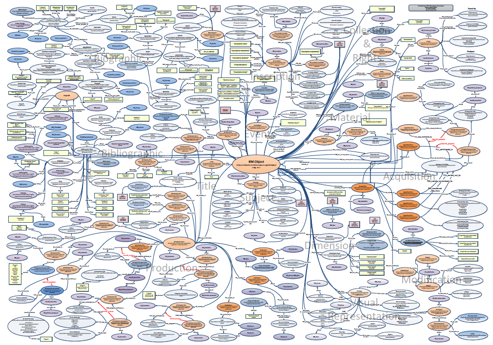

# The Conceptual Reference Model Revealed

## Quality contextual data for research and engagement: A British Museum case study
- Dominic Oldman, Joshan Mahmud, Vladimir Alexiev
- Version: Draft 0.98, July 2013 (Confidential & Private -- Limited Distribution for Discussion)

Moved from [ResearchSpace/BM Mapping](https://confluence.ontotext.com/display/ResearchSpace/BM+Mapping) since that confluence is retired.

[mapping-manual-draft-0.98a.pdf](mapping-manual-draft-0.98a.pdf)

Total: 359p
- 169: Main body, including discussion, illustrations and mapping diagrams
- 7p: Association Codes (see details at [BM Association Mapping v2](https://confluence.ontotext.com/display/ResearchSpace/BM+Association+Mapping+v2): not public)
- 49p: Example Object Graph
- 134p: mapping implementation as RDFer configuration files

## Overall Picture

[mapping manual-diagram.pdf](mapping manual-diagram.pdf), [mapping manual-diagram.png](mapping manual-diagram.png) (Page 9 of 359)

